# 2026-07-17: Single-authority agent workflow convergence

## Status

Accepted.

This ADR is the current implementation authority. The former
[Phase 4 Agent Workflow Reference](../phase-4-agent-workflow-reference.md) is
retired and provides historical context only. Final live-chain acceptance is
tracked by the current implementation roadmap and does not restore any retired
runtime contract.

The [2026-07-20 advisory publication and human-review decision](./2026-07-20-advisory-publication-human-review.md)
supersedes this ADR wherever this document assigns narrative verification a
publication veto, automatic focused rewrite, or `verified/withheld` publication
state.

The 2026-07-20 launch closeout uses the complete automated contract, verifier,
integration, Gateway, build, and stale-reference suite plus one fresh real-chain
Case B run after code freeze. Manual truth review, manual insight scoring, and
wording-pair review are optional research inputs and do not gate publication or
deployment.

## 中文执行摘要

这次修复应当停止围绕单个 binder、关键词或 Case B 症状继续打补丁，直接收敛整条工作流的权威关系。

核心决定如下：

1. 用户语言只在 `IntentRevision` 中完成一次业务绑定；澄清答案只填充现有 decision slot，实质性纠正或追加目标才创建新 revision。
2. baseline、时间、范围等已确认选择只写入 `DecisionLedger`，后续节点不再从文案重新识别。
3. `AnalysisRuntime` 方向上的确定性能力收敛成唯一 plan compiler；LLM 负责 issue tree、辅助维度、下钻优先级和候选假设。
4. 每个 capability 独立返回结构化 outcome，失败只沿依赖图影响对应 claims。
5. 因素导图和合同编译成公式图；地区、城市、设备、渠道等合格路径全部保留证据，达到业务重要性或用户明确要求的发现形成 claim，排名只影响执行与展示顺序。
6. `ClaimGraph` 形成一次业务真相，`AuthorityBundle` 以不可变 manifest 封存该版本的 claims、证据和边界。
7. DeepSeek 直接输出带 claim handles 的业务段落并保留原文；逐块 verifier 只拥有否决权。
8. 质量审计只反馈洞察与表达风险；持久化、交付和客户投影不能重新判断业务事实。
9. 每个 run attempt 在编译首个 plan 前自动解析最新 active release，后续 plan patch 继承同一权威上下文，用户界面不暴露权威模式选择。
10. capability 与 LLM 按 at-least-once 执行，AuthorityBundle 按 digest exactly-once 发布，delivery 通过 outbox 幂等重试。
11. 分析自由采用“宽探索 → 严证据结算 → 宽表达 → 窄发布校验”：planner 的 issue tree 和候选假设完整留痕，claim 按证据强度结算，writer 保留业务表达自由，verifier 只拥有否决权。
12. `AuthorityBundle` 封存所有 `user_required` obligation IDs；provider-facing `NarrativeMaterialProjection` 用不透明 requirement handle 表达必答 claim/limitation 闭环。必答覆盖只约束结构化 handles，writer 继续自由决定段落数量、顺序、重点、综合方式和业务措辞。

迁移采用无兼容替换：先建立新领域合同和持久 checkpoint，再依次切换意图与澄清、唯一 compiler、分支执行、ClaimGraph、claim-aware 文案、原子持久化和交付；每完成一层就删除对应旧实现与旧断言。最终以 Case A-D 和八类典型问题的真实 DeepSeek、真实 ClickHouse、真实 Postgres、真实 Gateway/Core 链路验收。

## Executive decision

WAJE BI v2 will converge on a single-authority, evidence-constrained autonomous
analysis architecture.

The runtime will cross four versioned authority boundaries:

```text
user intent
→ authorized observations
→ evidence-bounded claims
→ natural-language blocks that reference those claims
```

Each boundary has one authoritative output. Downstream stages may add a
new revision, reference an existing record, withhold a block, or create a safe
projection. They may not reconstruct, renumber, weaken, strengthen, or delete an
upstream business fact.

The architectural center is an immutable, content-addressed `AuthorityBundle`.
It is a small publication manifest that references intent, decisions, plan,
evidence, claims, assumptions, and limitations. It does not copy their full
payloads into one mutable object.

LangGraph remains the orchestration and progress surface. WAJE-owned typed
records, compilers, verifiers, and stores remain the source of business truth.

Development has no live users. The cutover will directly replace obsolete
behavior and tests. It will not add compatibility adapters, dual compilers,
dual-write modes, legacy readers, or long-lived feature flags.

## Pre-cutover context (historical)

Case B exposed a recurring failure pattern across the workflow:

1. local dictionaries interpret open business language;
2. the same decision or fact is recomputed in multiple layers;
3. a branch-local failure becomes a run-wide failure;
4. ranking, wording quality, persistence, or delivery obtains claim authority;
5. state recovery is described at workflow level while node results remain
   process-local until the run returns.

At decision time, responsibilities were concentrated in several large modules.
The paths below describe the removed architecture and are not current runtime
entry points:

- `bi_agent/runtime/langgraph_workflow.py`: formerly combined conversation,
  planning, execution, evidence reduction, writing, verification, repair, and
  persistence;
- `bi_agent/runtime/answer_package.py`: formerly combined claim construction,
  verification, narrative publication, scrubbing, delivery reverification, and
  projection;
- `bi_agent/runtime/final_narrative_binding.py`: formerly reinterpreted open
  business text after execution;
- `bi_agent/conversation/clarification_authority.py`: formerly repeated the same
  material decisions across projections;
- `bi_agent/runtime/runtime_persistence.py`: formerly combined storage integrity with substantial
  semantic closure logic.

The existing implementation also has foundations worth retaining:

- `AnalysisContract`, `QueryContract`, and `CapabilityExecutionPlan`;
- SQL compilation and SQL safety;
- current active release and snapshot authority;
- completeness and numerical reconciliation;
- content-addressed evidence and claim provenance;
- runtime contract registries;
- run dispatch identity, lease, heartbeat, and recovery;
- transactional runtime-record persistence and bundle digests;
- raw DeepSeek request, response, model, prompt, timing, and usage audit.

## First-principles invariants

### 1. One writer for each kind of truth

| Business fact | Sole authority |
|---|---|
| What the user wants answered | active `IntentRevision` |
| What the user or system accepted | `DecisionLedger` |
| What the system will execute | active `PlanRevision` |
| What each branch observed | `EvidenceLedger` |
| Which conclusions are authorized | `ClaimGraph` |
| Which conclusion set was sealed | `AuthorityBundle` |
| How DeepSeek expressed it | `NarrativeDocument` |
| What a client can display | `PublicationProjection` |

No layer may maintain a second semantic version of the same fact.

### 2. Truth is monotonic within a revision

After a claim is verified and sealed into an `AuthorityBundle`:

- narrative failure cannot delete it;
- quality review cannot change it;
- persistence cannot reclassify it;
- delivery cannot rebuild it;
- a new observation creates a new bundle revision;
- correction or withdrawal creates an explicit supersession or revocation
  record.

### 3. Failures propagate through dependencies

Every capability, evidence record, and claim is connected through stable IDs.
Failure radius is computed from those edges.

For example, unavailable payment-success data affects the payment-success claim
and any claim that explicitly depends on it. It does not affect paid-amount
direction, reconciled payer/frequency/ticket-size contributions, or successful
region and city analyses.

Shared failures can propagate broadly. A corrupt release manifest, invalid SQL
authority, or failed shared reconciliation affects every dependent branch.

### 4. Open semantics and closed contracts have different owners

LLMs own:

- natural-language intent binding;
- ambiguity discovery and business options;
- issue-tree and auxiliary route proposals;
- evidence interpretation and candidate insights;
- professional business writing;
- semantic entailment review and causal-language judgment.

Deterministic code owns:

- known goal, metric, dimension, formula, and capability IDs;
- dates, windows, target/baseline roles, and scope structure;
- permissions, fixed sensitive-output policy, and SQL safety;
- active release selection and run-level release pinning;
- data contract, schema, grain, completeness, and reconciliation;
- formula and statistical computation;
- evidence ceilings, references, digests, versions, and storage integrity.

Local code will not infer corrections, challenges, causal meaning, factor state,
or terminal business meaning from Chinese keyword dictionaries.

### 5. Ranking allocates attention

Ranking controls execution order, exploration budget, display order, and the
recommended next drill-down. It never decides whether an observed fact exists.
Every qualified result retains its own evidence and claim identity.

### 6. Execution, authority publication, and delivery use distinct guarantees

```text
capability and LLM execution: at least once
authority publication: exactly once by digest
delivery projection: idempotent and retryable
```

These guarantees are explicit in state, persistence, recovery, and tests.

### 7. Exploration, settlement, expression, and publication use different constraints

The analysis path follows this contract:

```text
wide exploration
→ strict evidence settlement
→ wide expression
→ narrow publication verification
```

- planning preserves the model's business-readable issue tree, auxiliary axes,
  competing hypotheses, and priorities as an immutable proposal;
- deterministic admission controls which proposal items may become executable
  plan items and records every admission outcome without erasing the proposal;
- claim settlement assigns an explicit epistemic class, evidence ceiling,
  support set, and boundary while allowing candidate mechanisms and scenarios to
  remain visible at their qualified strength;
- the writer controls narrative structure, emphasis, synthesis, and professional
  business wording over the verified `NarrativeMaterialProjection`;
- publication verification may accept or veto a block and may never rewrite the
  block, grant a claim, or increase claim strength;
- insight-quality evaluation is human-reviewed and advisory. An eval finding
  cannot become a runtime guardrail without a separate, generalizable policy
  decision with business and system ownership.

The records and checks for these responsibilities are introduced in their
assigned migration phases. Phase 2 establishes proposal retention and execution
admission only; it does not pull claim settlement, narrative verification, or
insight-quality evaluation forward.

## Target architecture

```mermaid
flowchart LR
  U["User turn"] --> I["Intent LLM"]
  I --> IR["IntentRevision"]
  IR --> D["DecisionLedger"]
  D --> RC["Resolve and pin latest active release"]
  RC --> PL["Planner LLM"]
  PL --> PPR["Immutable PlannerProposal"]
  PPR --> PC["Authoritative multi-pass compiler"]
  PC --> PAR["ProposalAdmissionRecord"]
  PAR --> PR["PlanRevision"]
  PR --> S["Capability DAG scheduler"]
  S --> CO1["CapabilityOutcome"]
  S --> CO2["CapabilityOutcome"]
  S --> CO3["CapabilityOutcome"]
  CO1 --> E["EvidenceLedger"]
  CO2 --> E
  CO3 --> E
  E --> CV["Claim verifier"]
  CV --> CG["ClaimGraph"]
  CG --> AS["Authority seal transaction"]
  AS --> AB["Sealed AuthorityBundle"]
  AB --> MP["Durable NarrativeMaterialProjection checkpoint"]
  MP --> W["Narrative LLM with claim-material projection"]
  W --> ND["NarrativeDocument blocks"]
  ND --> BV["Block-level verifier"]
  AB --> BV
  BV --> PP["PublicationProjection"]
  AB --> PT["Publication transaction"]
  ND --> PT
  PP --> PT
  PT --> OB["Delivery outbox"]
  OB --> UI["Gateway and UI"]
```



### Logical workflow stages

The product exposes ten stable business stages:

```text
bind_intent
→ resolve_material_decisions
→ resolve_data_authority
→ compile_plan
→ execute_ready_tasks
→ evaluate_claim_coverage
→ seal_authority_bundle
→ compose_narrative_blocks
→ verify_publication
→ persist_and_deliver
```

`evaluate_claim_coverage` may request a versioned `PlanPatch` when a valuable
claim remains unresolved and an admissible route exists. A patch produces a new
`PlanRevision`; it does not send the entire run back through intent parsing.

Coverage evaluation carries the current obligation subject and success policy,
required claim strength, public-safe observation facts, evidence kind and
strength, maximum claim strength, publication ceiling, data-contract state,
scope, window, dimension path, limitations, result/completeness references, and
the durable exploration-stop policy. Ordinary evidence remains
`evidence_present` until claim settlement and verification; only a typed
boundary with the required limitation and publication ceiling may close locally
as `explicit_boundary`.

The model may choose to seal the current evidence or request one of the supplied
routes. Deterministic route admission first proves data coverage, evidence and
claim-class compatibility, a ceiling that can satisfy the obligation, and the
actual incremental task cost against the remaining auxiliary budget. Each
admitted route then exposes its business name, semantics, selection policy,
per-obligation ceiling, cost, and expected-value projection so the model can
exercise analytical judgment inside the executable set.

Clarification pauses only when a material decision slot remains unresolved.
Narrative repair retries only rejected blocks. Persistence retry happens through
the outbox and does not restart analysis.

LangGraph may use three internal subgraphs for maintainability:

1. `ConversationGraph`: intent revisions, decisions, clarification, correction;
2. `AnalysisGraph`: planning, release pinning, execution, evidence, claims;
3. `PublicationGraph`: narrative, block verification, publication, delivery.

They exchange immutable references and append-only events. They do not exchange
large mutable dictionaries.

## Domain model

### `IntentRevision`

```text
intent_revision_id
supersedes_intent_revision_id?
original_user_text
goal_bindings[]
target_metric_refs[]
scope
time_spec
direction_premise
requested_analysis_axes[]
desired_decisions[]
ambiguity_slots[]
source_spans[]
schema_version
prompt_version
model_version
content_digest
```

`direction_premise` supports:

- `user_hypothesis_positive`;
- `user_hypothesis_negative`;
- `unknown`;
- `no_direction_requested`.

Observed direction can only enter the `ClaimGraph` after target and baseline
queries complete.

Each run attempt has one active intent revision. An option selection or free-text
answer that only resolves an existing ambiguity slot stays under that intent
revision. The LLM binds free text to the named slot and the runtime writes a new
decision record. A material change to goal, metric, time semantics, or scope
creates a new run attempt with a new intent revision connected through
`supersedes`. Runtime code never mutates a prior revision in place.

### `DecisionLedger`

```text
decision_id
intent_revision_id
slot_id
value
source: user | accepted_recommendation | safe_inference
status: unresolved | inferred | user_confirmed | invalidated
materiality
affected_plan_fields[]
option_id?
invalidated_by_revision_id?
content_digest
```

The ledger is the only authority for baseline, time, scope, comparison, and
other material decisions. Display text contains no authority. A displayed
option writes back a stable `option_id`; free text is bound to the existing slot
by the LLM. Only a material change beyond the slot creates a new intent revision.

A confirmed slot can reopen only when a new intent revision invalidates it or a
hard contract proves the selected value impossible. The invalidation is
explicit and auditable.

### `PlannerProposal`, `ProposalAdmissionRecord`, and `PlanRevision`

The planner's structured business proposal is immutable and content-addressed:

```text
PlannerProposal
- planner_proposal_id
- intent_revision_id
- decision_refs[]
- authority_context_ref
- issue_tree_nodes[]
- analysis_axis_proposals[]
- hypothesis_proposals[]
- priority_proposals[]
- assumption_proposals[]
- raw_provider_response_ref
- schema_version
- prompt_version
- model_version
- content_digest
```

The issue tree and hypotheses are business-readable analytical proposals, not
hidden chain-of-thought. The stored structured proposal and restricted raw
provider-response reference preserve what the planner proposed before admission.

Deterministic admission produces a separate immutable record:

```text
ProposalAdmissionRecord
- proposal_admission_id
- planner_proposal_ref
- intent_revision_id
- decision_refs[]
- authority_context_ref
- admission_entries[]
  - proposal_item_ref
  - item_kind
  - status: admitted | rejected | deferred
  - reason_code
  - contract_refs[]
  - normalized_execution_ref?
- compiler_version
- contract_versions
- content_digest
```

Admission reasons come from closed contracts, hard safety boundaries, duplicate
identity, execution budget, and dependency validity. The compiler does not use
open-language keyword rules to reinterpret a proposal. A structurally invalid
model response remains a failed model attempt; the runtime does not fabricate an
empty proposal or invoke a fallback compiler.

The accepted execution plan references both records:

```text
plan_revision_id
supersedes_plan_revision_id?
intent_revision_id
decision_refs[]
authority_context_ref
planner_proposal_ref
proposal_admission_ref
resolved_window_refs[]
claim_obligations[]
analysis_axes[]
capability_tasks[]
assumption_refs[]
budget_policy_ref
contract_versions
content_digest
```

The compiler may have several deterministic internal passes: normalize,
resolve, validate, budget, and schedule. Only one `PlanRevision` is published as
the accepted result.

The planner LLM proposes issue trees, auxiliary axes, hypotheses, and ordering.
The compiler derives mandatory tasks from accepted goals and claim obligations,
then admits LLM proposals that reference valid contracts. Invalid auxiliary
suggestions are recorded and omitted. They do not become user clarification.

Only admitted executable axes and tasks enter `PlanRevision.analysis_axes` and
`PlanRevision.capability_tasks`. Rejected, deferred, or currently non-executable
ideas remain in `PlannerProposal` with an explicit admission outcome, so the
original analytical exploration cannot disappear silently or masquerade as an
executed plan item.

The goal registry covers all eight typical business-question families. Each
goal declares required business outcomes, recommended candidate axes, evidence
ceilings, and completion policy. It is a planning contract rather than a fixed
route template: the LLM can add supported axes and hypotheses, while the
compiler prevents missing required obligations and invalid capability refs.

`ClaimObligation` expresses the business outcome, not the presence of a specific
tool:

```text
obligation_id
claim_kind
role: user_required | analyst_auxiliary
subject
evidence_requirement:
  operator: any_of
  evidence_kinds[]
success_policy
```

`any_of` is the only current evidence operator. Each proposed claim closes its
own requirement by binding at least one listed evidence kind. Evidence attached
to another claim under the same obligation cannot be borrowed during semantic
verification.

Requiredness belongs to the edge from a claim obligation to a capability task.
A capability has no run-wide required flag.

### `AuthorityContext`

Normal use always selects current authoritative data. The product exposes no
authority-mode selector.

Before compiling the first `PlanRevision` of a run attempt, the runtime resolves
the latest active release set and records actual `as_of`, release refs, snapshot
refs, dataset coverage, and contract versions. That authority context remains
pinned for every branch and every `PlanPatch` in the attempt.

If an active release changes during execution, the current attempt remains
reproducible. Ordinary replanning inherits the pinned context. A user refresh or
explicit new-data analysis creates a new run attempt and resolves the latest
release again. Results from different release sets cannot enter the same
authority bundle.

### `CapabilityTask` and `CapabilityOutcome`

```text
CapabilityTask
- task_id
- plan_revision_id
- capability_id
- normalized_input_refs[]
- dependency_task_ids[]
- supports_obligation_ids[]
- execution_policy
- idempotency_key

CapabilityOutcome
- task_id
- attempt_id
- status: succeeded | unavailable | integrity_failed |
          technical_failed | skipped | superseded
- evidence_refs[]
- affected_obligation_ids[]
- limitation_refs[]
- retryability
- failure_ref?
- input_digest
- output_digest
```

The idempotency key is derived from:

```text
plan_revision_id
+ task_id
+ normalized_input_digest
+ release_ref set
+ contract versions
```

Expected data gaps return typed outcomes. Exceptions are reserved for process
or integrity faults that the task cannot represent safely.

Independent tasks can run concurrently. Completion order cannot affect claim
identity, evidence membership, ranking, or final numbers.

### `FailureRecord`

```text
failure_id
layer: intent | plan | query | capability | evidence |
       claim | narrative | persistence | delivery
kind
scope: run | plan_revision | task | claim | narrative_block | delivery
affected_refs[]
integrity_level
retryability
user_actionable
business_boundary
technical_detail_ref
```

Policies consume typed fields and dependency edges. They never branch on an
exception message or business prose.

Run-wide blocking is limited to:

- corrupt run, intent, plan, or shared authority identity;
- permission or SQL-safety violation;
- shared release or snapshot authority failure;
- broken AuthorityBundle digest or reference closure.

When all admissible data paths are unavailable, the analysis produces a
verified `boundary_only` publication with the affected obligations and data
boundary. Data absence is not an integrity failure.

All other failures remain scoped to their affected references.

### `EvidenceLedger`

The ledger retains existing content-addressed query, rows, snapshot,
completeness, and capability-binding records. Each evidence record additionally
exposes orthogonal states:

```text
execution_state: available | unavailable | integrity_failed | technical_failed
evidence_kind: observed | derived | scenario | statistical_association
data_contract_state
supported_claim_kinds[]
maximum_claim_strength
observation_facts[]
scope
window_refs[]
dimension_path
limitation_refs[]
```

Missing state has no verified default. A neutral payment-success assumption is
stored as `scenario`; it does not create an observed `1.0` value.

The ledger keeps all admissible evidence. `primary_evidence_ref` may exist as a
display preference and never replaces the support set.

### `ClaimGraph`

Each claim separates logical identity from content revision:

```text
claim_key
- goal_id
- claim_kind
- subject
- metric_ref
- target_window_ref
- baseline_window_ref
- scope
- grain
- dimension_path

claim_ref
- claim_key
- factual_payload
- claim_class
- support_edges[]
- dependency_claim_refs[]
- limitation_refs[]
- status
- publication_ceiling
- content_digest
```

Claim classes include:

- observed fact;
- accounting identity contribution;
- dimension localization;
- statistical association;
- candidate mechanism;
- causal effect;
- scenario;
- boundary.

Observed facts, accounting identity contributions, statistical associations,
candidate mechanisms, scenarios, and boundaries keep distinct identities and
publication ceilings. A candidate mechanism can remain useful and visible with
its supporting context and limitations without being promoted into an observed,
accounting, association, or causal claim.

Support edges include `supports`, `qualifies`, `depends_on`, `contradicts`, and
`contextualizes`.

Capability outputs can authorize observed, derived, and statistical-association
claims. Statistical association requires a qualified statistical capability;
the LLM interprets its business meaning. LLMs may propose candidate mechanisms
and action implications. Claim verification constrains every proposal to the
evidence ceiling. A semantic verifier has veto power and cannot grant evidence
or a stronger claim.

Multiple evidence records may support one claim. Multiple child claims may
exist under a formula or dimension parent. A `max()` selection by coarse claim
type cannot remove siblings.

Action recommendations use a separate record because they express a decision
under conditions rather than an observed fact:

```text
RecommendationRecord
- recommendation_ref
- supporting_claim_refs[]
- assumption_refs[]
- risk_refs[]
- action
- applicable_conditions[]
- expected_decision_value
- verifier_report_ref
```

The LLM may propose a recommendation. Verification checks its supporting
claims, assumptions, risks, and conditions. The record cannot inherit
`verified fact` status from the ClaimGraph.

### `AuthorityBundle`

```text
bundle_ref
bundle_revision
supersedes_bundle_ref?
run_attempt_id
intent_revision_id
decision_refs[]
plan_revision_id
authority_context_ref
required_obligation_ids[]
obligation_coverage_refs[]
evidence_refs[]
verified_claim_refs[]
recommendation_refs[]
assumption_refs[]
limitation_refs[]
claim_verifier_report_ref
bundle_digest
sealed_at
```

The bundle is an immutable manifest over content-addressed child records. One
run attempt can seal at most one AuthorityBundle, and every `PlanPatch` occurs
before that seal. New data or a material business correction creates a new run
attempt and, when successful, a new bundle connected through
`supersedes_bundle_ref`. Source revocation creates a `RevocationRecord`; it does
not rewrite historical records.

External `record_ref` values include the run/thread ownership namespace. A
separate `content_digest` represents content equality. Equal digests across
threads never grant cross-thread access.

Rejected claims live in `claim_verifier_report_ref`; they are not members of the
sealed authority manifest.

`required_obligation_ids` is derived exactly from the accepted `PlanRevision`
entries whose role is `user_required`. Analyst-added auxiliary obligations stay
in settlement and audit, but they do not become mandatory customer-publication
requirements. The sealed IDs prevent a downstream writer or projection from
silently redefining which parts of the user's request must reach the answer.

### `NarrativeDocument` and `NarrativeBlock`

The public-safe claim palette remains the complete derivation source for claims,
recommendations, limitations, and reviewed facts. Before the first provider
call, the runtime derives and durably checkpoints one
`NarrativeMaterialProjection` from that palette, the accepted claim settlement,
and the exact supporting evidence entries. The checkpoint is atomic and
content-addressed; a conflicting replay or unavailable checkpoint blocks the
provider call and surfaces the typed failure.

The projection pools repeated public facts by evidence material, preserves
lossless source-fact closure, converts repeated limitation context into shared
boundary facets, and binds every claim to the material handles it may use. This
removes transport duplication without truncation, sampling, top-N selection, or
locally generated substitute prose. Each canonical capability observation is
bounded at 64 KiB when evidence is created. The complete serialized provider
message envelope is bounded at 512 KiB immediately before dispatch. Exceeding
either contract is a visible non-retryable boundary failure.

The projection also contains one content-addressed publication requirement for
each sealed `user_required` obligation. Internal records retain the obligation,
basis, coverage refs, and digests. For each requirement, the writer and block
verifier see only:

```text
publication_requirement
- requirement_handle
- status: satisfied | mixed | contradicted | unavailable
- required_claim_strength
- claim_handles[]
- limitation_handles[]
```

The handle set follows the same closure rules as customer publication:

- `satisfied`: at least one listed claim reaches the required strength, and the
  coverage has no limitation;
- `mixed`: at least one accepted coverage claim and every listed limitation;
- `contradicted`: at least one accepted coverage claim and every listed
  limitation;
- `unavailable`: no claim and every listed limitation.

Only handles carried by blocks marked `required` satisfy these requirements.
This contract controls answer completeness without prescribing prose. The writer
remains free to choose block count, ordering, roles, emphasis, comparison,
synthesis, and wording within claim ceilings and exact material bindings.

The writer and verifier receive the same `NarrativeMaterialProjection`. They do
not receive the derivation palette, raw rows, SQL, owner fields, internal debug
enums, secrets, or unrestricted evidence payloads. Internal claim, material,
fact, recommendation, limitation, and boundary-facet refs are mapped to short
per-call handles outside the text channel.

DeepSeek returns:

```text
NarrativeDocument
- narrative_id
- authority_bundle_ref
- raw_provider_response_ref
- blocks[]

NarrativeBlock
- block_id
- role: executive_answer | direction | accounting_drivers |
        dimension_localization | contextual_pattern | boundary | next_action
- text
- claim_handles[]
- limitation_handles[]
- material_fact_bindings[]
- statement_role
```

`text` preserves the raw DeepSeek business expression. Handles are resolved to
authority refs through a separate structured channel. Provider-facing
`material_fact_bindings` contain only a claim handle and fact handle. The
runtime resolves fact kind, value, range end, and unit directly from the durable
projection when it constructs the typed `NarrativeBlock`; the model never
retypes those authoritative fields.

Validation occurs per block:

1. local schema, handle, numeric binding, date, scope, and sensitive-output
   checks;
2. semantic entailment and evidence-strength review by a verifier model;
3. accepted blocks retain the same typed block identity, digest, writer-attempt
   provenance, and provider text;
4. rejected required blocks may receive a focused writer attempt under the
   centralized retry and risk policy; the provider returns only replacement
   target blocks, and its response and audit remain target-only;
5. the runtime merges accepted source blocks and replacement target blocks in
   source order, creating a mixed-origin narrative revision whose parent is the
   source narrative; the verifier supplies rejection reasons and never
   replacement prose;
6. rejected auxiliary blocks are omitted with an audit record;
7. a required block that still fails is withheld, while its structured
   claim/evidence status remains visible in the audit and business-process UI.

After verification, publication readiness is computed from the accepted
required blocks. Every publication requirement must still have its status-
appropriate claim and limitation handles. A veto that removes the only covering
required block therefore enters focused repair and then withholding if coverage
cannot be restored.

Local code does not split Chinese sentences, resolve pronouns, enumerate causal
words, rewrite business wording, or generate fallback conclusion sentences.

### `PublicationProjection`

```text
projection_id
authority_bundle_ref
narrative_id
accepted_block_ids[]
omitted_block_ids[]
display_order[]
field_visibility_policy_ref
visualization_refs[]
warnings[]
projection_digest
```

Projection may perform fixed field removal, ordering, and deterministic
visualization sampling. A projection manifest proves that it added no claim and
did not increase claim strength. Projection failure cannot modify authority.

`PublicationFlow` retains a final hard gate over the resolved customer payload.
It recomputes every `user_required` obligation from the accepted plan, settlement
basis, coverage, accepted claims, and published limitation refs. A mismatch is a
typed publication-closure failure. This gate is an independent trust-boundary
assertion; normal execution should satisfy it earlier through the material
projection and accepted-required-block closure.

Translation creates a new NarrativeDocument revision and must pass block
verification again. It is not a projection operation.

## Orthogonal state model

A single `workflow_status` will be replaced with independent lifecycle states
and an obligation-coverage vector:

```text
interaction_status:
  active | waiting_for_user | closed | superseded

analysis_status:
  pending | planning | executing | complete | boundary_only |
  blocked | superseded

publication_status:
  not_ready | composing | verified | withheld

delivery_status:
  pending | persisted | published | retryable_failed | permanently_failed

obligation_coverage[obligation_id]:
  satisfied | contradicted | mixed | unavailable | unresolved | not_requested
```

The pre-settlement loop uses a separate typed state:

```text
claim_coverage_evaluation[obligation_id]:
  uncovered | evidence_present | explicit_boundary
```

`evidence_present` preserves qualified observations for interpretation and
keeps the obligation open. During settlement, accepted lower-strength claims
remain publishable at their own ceiling and produce `mixed` coverage with an
explicit strength-gap limitation; they cannot satisfy a stronger obligation.

Examples:

| Situation | Analysis | Obligation coverage | Publication | Delivery |
|---|---|---|---|---|
| Payment success unavailable; core factors complete | `complete` | core `satisfied`, payment success `unavailable` | `verified` | `published` |
| Target date has no authoritative data | `boundary_only` | target claims `unavailable` | `verified` | `published` |
| PostgreSQL write fails after verification | `complete` | unchanged | `verified` | `retryable_failed` |
| Shared release digest is corrupt | `blocked` | unresolved | `withheld` | `pending` |

## LLM and deterministic responsibility matrix

| Stage | LLM authority | Deterministic authority |
|---|---|---|
| Intent | bind open language to supplied goal/metric/axis catalog | validate IDs, source spans, dates, transitions |
| Clarification | propose concise business options and a recommendation | open only unresolved material slots; store option IDs |
| Planning | create an immutable business-readable issue tree, axes, hypotheses, and priorities | retain the proposal; deterministically admit executable items; compile mandatory obligations, contracts, budget, and DAG |
| Query | describe business need | compile SQL, enforce parameters, release, safety, and grain |
| Analysis | interpret multiple results and propose candidate insights | formula, statistics, completeness, and reconciliation |
| Claims | interpret statistical associations; propose mechanisms and implications | statistical capabilities produce association facts; verifier closes refs and enforces ceilings |
| Narrative | freely choose structure, emphasis, synthesis, and professional wording over the material projection | validate handles, claim-material pairs, and facts without rewriting text |
| Semantic review | veto unsupported block meaning | prevent the reviewer from granting claims, increasing strength, or returning replacement wording |
| Quality review | human-review explanation value, novelty, decision usefulness, competing hypotheses, uncertainty, and actionability | advisory result or a separately identified rewrite request; no direct guardrail promotion |
| Persistence | none | schema, digest, references, transaction, idempotency |
| Delivery | none | ownership, field policy, projection manifest, outbox |

High-value model calls use centrally configured risk profiles. Provider timeout,
retry, model tier, and thinking mode remain in the LLM client layer. A retry is
a new attempt with a stable parent reference. Outputs from two attempts cannot
be merged implicitly.

## Analytical design

### Formula graph from the factor SSOT

`付费金额影响因子分析.mm` remains the business SSOT for metrics, factors,
formulas, dimensions, gaps, and routes. A build-time compiler converts the
reviewed graph into versioned runtime contracts and a formula AST. Runtime
consumes the validated contract snapshot and records its digest.

The generic decomposition engine handles supported multiplication, addition,
ratio, bridge, and hierarchy expressions. A new formula node requires a contract
change and no date-, case-, or sentence-specific code.

Observed inputs, scenarios, and missing inputs remain distinct throughout
decomposition and publication.

### Analysis axes and dimension localization

Every contract-compatible axis enters the candidate universe. The LLM builds a
business issue tree and may propose dimensions, hierarchies, time windows,
outliers, mechanisms, and cross-source analysis. A budget governor orders tasks
using expected information gain, unexplained movement, materiality,
actionability, statistical risk, and cost.

The runtime does not query every combinatorial axis automatically. It also does
not silently remove successful axes. Every successful qualified hierarchy keeps
its evidence profile and the reason it was or was not selected. Findings that
meet business materiality, explanation value, or an explicit user request form
child claims. Ranking controls priority and display.

Product context belongs in a versioned business-context contract. WajeGame's
contract marks country as invariant and non-diagnostic for routine revenue-cause
analysis because the product serves the Nigerian market. Routine localization
starts with region and city. Country becomes eligible only for an explicit
cross-country, data-quality, or product-scope question. This rule is driven by
business context and does not depend on one question string.

Overlapping dimensions such as region, channel, device, and user value cannot
have independent contribution percentages summed. Additive contribution claims
require a qualified joint-attribution method. Independent screens publish
localization and mix-shift evidence.

### Baselines and temporal context

The user-confirmed primary baseline determines the principal direction and
amount change. Additional windows provide context and stability evidence. They
cannot silently replace the primary comparison.

Baseline disagreement is a publishable finding. The answer states the primary
result and the contextual difference. Window derivation follows goal and intent;
it has no fixed seven-day default for unrelated questions.

### Correlation and exploratory analysis

Cross-source association requires a versioned mapping contract, mapping digest,
known coverage, aligned grain, and release consistency. Unknown mapping coverage
cannot pass an association authority gate.

Exploratory discovery remains distinguishable from confirmatory evidence. Large
dimension, lag, and window searches apply a versioned multiplicity and stability
policy. Time-series association checks autocorrelation, shared trend,
non-stationarity, lag search, and leakage. Correlation can authorize association
or a candidate mechanism within its ceiling; it cannot grant causal effect.

### Exploration stop policy

The runtime stops or asks for expansion according to structured criteria:

- required direction and accounting obligations are resolved;
- remaining unexplained movement is below business materiality;
- the next task has low expected information gain;
- new evidence is unlikely to change the action recommendation;
- statistical discovery risk is rising faster than evidence value;
- the approved execution budget is exhausted.

The LLM recommends the next analytical action. The budget governor validates
admissibility and records why the run continued or stopped.

## Security and trust boundaries

### Data-to-prompt boundary

Query values, dimension labels, activity names, payment labels, and external
text are untrusted data. They are passed as typed, escaped data fields and never
concatenated into system instructions. Raw text fields require an allowlisted
contract before entering a model prompt.

The writer and verifier receive only the durable public-safe material projection
and per-call handles. Returned handles are checked for existence, active run
ownership, scope, claim-material pair membership, and exact fact binding inside
the supplied projection.

Raw provider responses remain in restricted admin audit storage under the
project retention policy. Customer output uses verified blocks only.

### Query and aggregate privacy

All normal users share the same analyst capability. Identity affects history
ownership, audit, rate limits, and performance safety only.

Supported region, city, device, channel, and other aggregate axes remain
queryable. Protection targets raw identifiers, unsafe grain, and individual
sparse cells. Unsafe cells are suppressed or rolled up without failing the
whole dimension task.

A cross-query privacy budget is outside the current v2 delivery scope. It
requires a separate threat model and ADR before adoption so it cannot become a
blanket blocker for aggregate region, city, device, or channel analysis.

### Claim and delivery authority

SQL AST checks, permissions, release authority, contracts, provenance, and
digests remain hard boundaries. Planner, writer, semantic verifier, quality
reviewer, persistence, projector, and client cannot grant a claim absent from
the active authority graph.

## Durability, concurrency, and recovery

### Durable checkpoints

Current `graph.compile()` has no persistent checkpointer, and run-node events are
written after the workflow returns. Run dispatch recovery therefore does not
provide node-level workflow recovery.

The target graph uses a Postgres-backed LangGraph checkpointer or an equivalent
durable execution journal. Every decision, model call, query attempt,
capability outcome, claim verification, and publication step records:

- stable event and parent IDs;
- input and output digests;
- intent and plan revisions;
- release and contract versions;
- attempt number and retry reason;
- status and next transition.

The record is durable before the workflow advances to its next authoritative
transition.

### Resume, retry, correction, and cancellation

Resume reuses a completed output when the idempotency key and digest match.
Reinvoking an LLM creates a new attempt. Only one attempt can be accepted for a
given transition.

User correction or cancellation marks the active intent and plan revisions as
superseded and stops scheduling new tasks. In-flight results are stored as
orphaned evidence and cannot bind automatically to a new revision.

Authority seal uses compare-and-swap on bundle digest. Duplicate dispatches may
execute, while only one AuthorityBundle for the run attempt commits.

### Authority seal, publication transaction, and delivery outbox

Two transactions keep business authority independent from writing and delivery:

1. `AuthoritySealTransaction` atomically seals the ClaimGraph and
   AuthorityBundle exactly once;
2. `PublicationTransaction` binds the sealed AuthorityBundle, accepted
   NarrativeDocument revision, block-verifier report, PublicationProjection,
   and a delivery-outbox record.

Narrative composition can retry after the AuthorityBundle exists. A new
narrative or projection produces a new publication revision and never reseals
business authority. A projector retries delivery idempotently. Publication
success followed by client-package failure produces
`delivery_status=retryable_failed`; verified claims remain unchanged.

## Observability

The trace hierarchy follows stable causal identities:

```text
thread
└─ turn
   └─ run_attempt
      ├─ intent_revision
      ├─ plan_revision
      ├─ capability_attempt
      │  └─ query_attempt
      ├─ claim_verification
      ├─ narrative_block_verification
      └─ authority_publication / delivery_attempt
```

Each event records parent, sequence, input/output digest, release, contract,
prompt, model, duration, cost, retry reason, failure scope, and result status.
High-cardinality SQL, raw values, and full refs remain in controlled audit
storage and do not become metric labels.

Business-visible progress uses business checkpoints and conclusions. Admin
trace contains technical records without hidden chain-of-thought.

Required service-level indicators include:

- share of main questions that reach a publishable answer;
- repeated-clarification rate;
- auxiliary-to-global failure amplification rate;
- verified-claim retention through narrative and delivery;
- verifier rejection reasons;
- time to first material business decision;
- time to final answer;
- query and model cost per successful analysis;
- release freshness and within-run release consistency;
- resume success and duplicate-publication rate.

## Migration plan

The migration follows vertical business checkpoints. Each phase replaces its
old authority immediately and deletes superseded tests and code. No phase leaves
a permanent adapter or fallback path.

### Phase 0: Freeze vNext contracts and acceptance invariants

Deliver:

- schemas for every domain record in this ADR;
- stable ID, revision, digest, and parent/supersession rules;
- typed `FailureRecord` taxonomy;
- real-chain acceptance entry through Gateway or `ConversationAgentCore`;
- architecture RED checks listed below.

Remove:

- any runtime path that simulates a user conversation or substitutes scripted
  model output;
- obsolete compatibility assertions and superseded data shapes;
- production/live mode aliases when they express the same real runtime.

Gate:

- PostgreSQL, ClickHouse, DeepSeek, and latest active release are reachable;
- a real Case B turn reaches its first legitimate material decision;
- human input is required for any clarification;
- no test harness manufactures a business answer.

### Phase 1: Durable journal, revisions, and decisions

Deliver:

- durable workflow checkpointing;
- `IntentRevision` and `DecisionLedger`;
- stable option-ID writeback;
- correction, cancellation, and supersession semantics.

Remove:

- business-semantic `_classify_intent`, `_topic_relation`, `_analysis_objectives`,
  `_mentioned_*`, `_needs_clarification`, and clarification-answer keyword
  functions from `bi_agent/conversation/runtime.py`;
- duplicated intent, route, execution, and completed-material projections in
  `bi_agent/conversation/clarification_authority.py`;
- baseline reverse parsing from presentation text.

Gate:

- ten real intent calls may vary in prose while material bindings remain stable;
- choosing the previous-day option creates one confirmed baseline decision;
- a resumed Case B run never asks for the same baseline again;
- killing the process after intent or decision persistence resumes correctly.

### Phase 2: Single plan compiler and release pinning

Deliver:

- authoritative multi-pass compiler;
- `PlanRevision`, claim obligations, analysis axes, and capability DAG;
- latest-active-release resolution pinned per run attempt and inherited by plan
  patches;
- immutable `PlannerProposal` records that retain the original issue tree,
  auxiliary axes, hypotheses, and priorities;
- deterministic `ProposalAdmissionRecord` records whose accepted items are the
  only proposal-derived axes and tasks allowed into `PlanRevision`.

Remove:

- the second compiler and fallback compile path;
- route acceptance and repair loops that recreate user decisions;
- caller-injected requested nodes;
- query-plan or first-row dimension inference used as publication authority.

Retain and consolidate:

- valid physical binding, metric, dimension, query-contract, and snapshot
  validation from the current analysis compiler and `AnalysisRuntime`.

Gate:

- the audit contains one accepted plan digest;
- the audit retains one planner-proposal digest and its deterministic admission
  digest, including rejected and deferred proposal items;
- an invalid auxiliary item is recorded without becoming a clarification,
  fabricated replacement proposal, or fallback-compiler input;
- Case B includes primary comparison, formula graph, eligible dimension
  universe, temporal context, and data-quality obligations;
- payment-success unavailability does not make the plan non-executable;
- all branches use one release set.

Phase 2 stops at the accepted execution plan. Claim-class settlement, narrative
composition and verification, and human-reviewed insight-quality evaluation
remain Phase 4, Phase 5, and Phase 6 work respectively.

#### Phase 2 implementation status (2026-07-18)

Phase 2 is implemented through the `planned` boundary:

- the live graph has one intent/decision/plan authority path and the superseded
  compiler, route-repair, obligation, model, and recipe authorities are removed;
- PostgreSQL accepts the authority context, planner proposal, admission record,
  plan revision, and transition in one transaction after rebuilding every
  content-addressed record, validating proposal-to-plan admission closure, and
  comparing the transition parent with the current accepted head;
- planner audit validation closes the actual provider response through the same
  structured-response parser used by the LLM client, then verifies the exact
  structured proposal, provider, routed model, prompt, transition, and response
  digest;
- Gateway planned/replay responses require the complete authority bundle and use
  a fixed customer projection; interaction directives expose only their public
  handle, business status, and stable explanation;
- the real Case B acceptance runner persists the explicit baseline decision,
  compiles one pinned plan, and stops before SQL execution or answer publication.

Executable evidence lives in
[`test_single_authority_phase02.py`](../../tests/phase7/test_single_authority_phase02.py),
[`test_single_authority_phase02_postgres.py`](../../tests/phase7/test_single_authority_phase02_postgres.py),
[`test_gateway_phase02_planned.py`](../../tests/phase7/test_gateway_phase02_planned.py),
and
[`run_single_authority_phase02_acceptance.py`](../../tools/phase7/run_single_authority_phase02_acceptance.py).

### Phase 3: DAG execution, formula graph, and branch isolation

Deliver:

- idempotent DAG scheduler and typed outcomes;
- dependency-scoped failure propagation;
- factor-SSOT formula AST and generic decomposition;
- independent hierarchy outcomes for region/city, device, channel, and other
  supported axes;
- budget governor and exploration stop records.

Remove:

- the giant sequential `_execute_capabilities` implementation;
- specialized promotion loops whose state is already representable as plan
  tasks;
- three-factor-only decomposition authority;
- error-message prefix parsing in completeness and degradation policies.

Gate:

- target/baseline direction and formula contribution reconcile;
- a failed auxiliary task changes only its affected claim obligations;
- independent task completion order produces identical authority inputs;
- every successful qualified hierarchy remains in the evidence ledger;
- killing the process after any task resumes without duplicate binding.

### Phase 4: ClaimGraph and sealed AuthorityBundle

Deliver:

- stable claim keys and content revisions;
- many-to-many evidence support edges;
- obligation-vector sufficiency;
- distinct epistemic identities and ceilings for observed facts, accounting
  contributions, statistical associations, candidate mechanisms, scenarios,
  and boundaries;
- claim strength ceilings, semantic veto, and sealed bundle manifest;
- exact `user_required` obligation IDs in the sealed bundle manifest.

Remove:

- `max()` winner selection by coarse claim type;
- global evidence reduction that unions unrelated limitations;
- claim reconstruction inside Answer Package;
- empty or missing evidence state defaults that become verified.

Gate:

- claim IDs remain identical through workflow, store, and client projection;
- ranking changes display order without changing the bundle digest;
- region/city and device evidence coexist, and material findings can coexist as
  child claims;
- missing payment success leaves only its obligation unresolved;
- an exploratory hypothesis may survive as a candidate mechanism, scenario, or
  boundary without being promoted to an observed, accounting, or association
  claim;
- a duplicate authority seal commits one bundle digest.

### Phase 5: Claim-aware narrative and block verifier

Deliver:

- durable `NarrativeMaterialProjection` derived from the public-safe palette,
  claim settlement, and exact evidence entries before any provider call;
- opaque publication requirements derived from sealed `user_required`
  obligations and their settlement basis and coverage;
- DeepSeek `NarrativeDocument` with original block text;
- writer control over narrative structure, emphasis, synthesis, and business
  wording;
- local structured checks and semantic block veto;
- focused new writer attempts for rejected required blocks, with independent
  attempt identity, target-only provider output, deterministic runtime merge,
  and unchanged typed provenance for accepted sibling blocks;
- veto-only verifier reports that never contain replacement prose.

Remove:

- `bi_agent/runtime/final_narrative_binding.py`;
- semantic publication authority from `bi_agent/runtime/wording.py`;
- factor-state regex, Chinese pronoun resolution, causal-word dictionaries,
  terminal drift dictionaries, punctuation parsing, and text mutation;
- the second final-summary generation after answer verification;
- quality-gate ability to erase verified facts.

Gate:

- raw DeepSeek output is preserved in restricted audit;
- valid blocks survive any sibling-block failure;
- decimal punctuation, Unicode minus signs, natural direction wording, brand
  labels, and model names do not trigger local semantic rejection;
- unsupported numbers, target/baseline reversal, scope drift, and causal
  overreach are rejected at the corresponding block;
- the verifier can accept or reject original text and cannot mutate it, draft a
  replacement, or grant a stronger claim;
- every publication requirement is covered by verifier-accepted required blocks
  under its status-specific claim and limitation rules;
- final business writing retains full analytical depth.

### Phase 6: Independent authority seal, pure delivery, and insight evaluation

Deliver:

- exactly-once AuthorityBundle seal transaction;
- separately retryable narrative/verifier/projection publication transaction;
- delivery outbox and idempotent customer projection;
- orthogonal analysis, publication, and delivery states;
- digest-based cross-boundary validation;
- human-reviewed insight-quality evals covering explanation value, novelty,
  decision usefulness, competing hypotheses, uncertainty handling, and
  actionability;
- advisory quality results that may request a separately identified narrative
  attempt without mutating claims, accepted text, or publication authority;
- a reviewed promotion path requiring a generalizable failure pattern and joint
  business and system ownership before any eval finding becomes a runtime
  guardrail.

Remove:

- `scrub_answer_package_for_delivery`;
- `reverify_answer_package_for_delivery`;
- `reproject_answer_package_from_persisted_authority`;
- `_delivery_reverify_with_answer_repair`;
- persisted claim repartition, renumbering, and semantic regeneration;
- refresh logic that writes the same artifact twice after workflow completion.

Retain:

- transaction, digest, ownership, source-record closure, and safe-field checks in
  persistence;
- run-dispatch lease and heartbeat infrastructure.

Gate:

- persist, load, project, and deliver preserve bundle digest and claim IDs;
- projection removes only fields forbidden by the visibility policy;
- a delivery failure leaves analysis and publication verified;
- outbox retry completes without rerunning LLMs, queries, or claim verification;
- a low insight-quality score remains advisory and preserves the sealed bundle
  and accepted narrative revision;
- a single eval case or model preference cannot create a runtime guardrail.

### Phase 7: Delete the old workflow and finish product acceptance

Deliver:

- a small orchestration graph matching this ADR;
- updated workflow, contract, state, runbook, and eval documentation;
- eight-question launch acceptance matrix results.

Remove:

- the old `bi_agent/runtime/langgraph_workflow.py` implementation after the new
  graph becomes the sole entrypoint;
- superseded Answer Package, material-authority, binder, compatibility, and
  scripted-workflow tests;
- old schema branches and legacy artifact readers without production consumers.

Gate:

- the legacy-symbol deletion checks pass;
- Case A, B, C, and D complete through the real workflow;
- all eight typical question families pass their required real-chain runs;
- architecture reference, artifact schema, and implementation agree.

## Verification strategy

### Closed-contract tests

Deterministic tests cover SQL AST, permission and sensitive-output policy,
contract schema, date/window math, formula math, statistical procedures,
reconciliation, digests, reference closure, idempotency, and state transitions.
They may construct typed domain records directly. They do not simulate an LLM
conversation or count as product acceptance.

### Real LLM stability checks

High-risk semantic nodes use repeated real calls with saved raw outputs:

- intent binding and ambiguity slots;
- issue-tree and plan proposals;
- candidate insight creation;
- answer block composition;
- semantic block verification.

For a fixed material input, schema, refs, and hard-boundary decisions must remain
stable. Business prose and ranking can vary within the accepted contract.

### Optional insight-quality evaluation

Insight quality is evaluated against real user wording and structured
expectations. Human reviewers assess explanation value, novelty, decision
usefulness, competing hypotheses, uncertainty handling, and actionability. The
result is advisory and may inform prompts, model selection, or a separately
identified writer attempt. It is excluded from launch and per-publication gates.

An individual failure, phrase preference, or model output does not become a
runtime guardrail. Promotion requires a recurring and generalizable failure
pattern, human validation, and joint business and system ownership. Hard legality
and evidence boundaries remain code or contract responsibilities regardless of
eval outcomes.

### Fault-injection checks

Use the real workflow and real storage boundary while injecting controlled
failures:

- crash after any durable node;
- duplicate dispatch;
- two LLM attempts with different responses;
- random parallel-task completion order;
- active release changes during execution;
- auxiliary dimension failure;
- authority commit followed by delivery failure;
- user correction during query execution;
- malicious dimension text attempting prompt injection;
- sparse-cell suppression while the containing dimension task still succeeds;
- narrative-only changes with an unchanged AuthorityBundle digest.

### Real-chain Case B launch gate

The real Case B protocol remains:

1. start a new thread with the original question;
2. report the model-bound understanding;
3. ask only a genuinely unresolved material decision;
4. let the human choose the previous-day recommendation;
5. never reopen that decision;
6. query target and baseline from the pinned latest active release;
7. verify the user-supplied upward premise before attribution;
8. reconcile formula contributions;
9. preserve first-charge observation and payment-success boundary separately;
10. retain qualified region/city and other dimension claims;
11. derive temporal context from the goal rather than a fixed seven-day rule;
12. show DeepSeek raw business output, structured claims, evidence, verifier, and
    boundaries;
13. persist and deliver without changing the claim set.

After code freeze, Case B must complete one fresh real run through Gateway,
PostgreSQL, ClickHouse, and the configured LLM provider. Restart/resume,
duplicate dispatch, and post-seal recovery remain automated fault-injection
checks so launch does not depend on repeated manual runs.

The fresh attempt stored under the `verified-03` artifact label is diagnostic
evidence and does not count as a successful run. Its writer output passed typed
fact binding and block verification, then the final publication gate found that
one `user_required` obligation was absent from the customer payload. The reusable
failure class is **late required-obligation closure**: settlement knows what must
be answered, while the provider contract omits that obligation and discovers the
gap only at publication. The architectural fix is to project the requirement
before writing, enforce it across required blocks, include it in focused repair,
and retain the final `PublicationFlow` hard gate.

The fresh attempt stored under the `verified-04` artifact label is also
diagnostic evidence and does not count as a successful run. Its first narrative
revision reached focused repair, then the focused writer contract required the
provider to reproduce accepted sibling blocks together with rejected targets.
That mixed provider/runtime ownership caused repeated scope rejection. The
reusable failure class is **focused-repair authority duplication**. The current
contract sends only rejected targets to the provider, keeps that raw response
target-only, reuses accepted typed blocks with their original identity and
writer provenance, and performs a deterministic source-order merge in runtime.
Failure terminals also persist the same safe `operational_failure` projection
returned by Agent Core, so Gateway can expose the typed terminal state without
weakening its fail-closed publication checks.

The fresh attempt stored under the `verified-05` artifact label reached a sealed
AuthorityBundle, then failed while materializing the initial writer output. The
writer used an optional `direction` block bound only to a verified recommendation;
all handles were valid and the prompt allowed free role selection, while the
typed block constructor permitted recommendation-only authority only for
`next_action`. The provider validator did not share that structural rule, so the
durable call was accepted before materialization exposed the mismatch. This is
the reference failure for **provider-validator/materializer contract drift**.
The current handle grammar allows a non-boundary block to be authorized by a
claim or verified recommendation, requires a boundary block to carry a
limitation, requires `next_action` to carry a recommendation, and is shared by
provider validation and typed block construction. Claim and limitation scope
remain local block-validation concerns that can enter focused repair.

### Eight-question acceptance

Each typical question family runs at least:

- one original natural-language question;
- one natural paraphrase;
- human input for every opened clarification;
- current active release, real PostgreSQL, real ClickHouse, real DeepSeek, and
  Gateway or `ConversationAgentCore`;
- no harness-generated business answer or automatic clarification response.

Acceptance evaluates structural invariants and business quality together:

- equivalent wording yields equivalent material intent and decisions;
- unavailable data affects only dependent claims;
- multiple qualified dimensions remain visible;
- formula, statistical, association, and causal claims keep distinct ceilings;
- narrative, quality, persistence, and delivery cannot reclassify authority;
- professional answers contain conclusion, quantified contribution, business
  localization, mechanism boundary, and action relevance;
- hard safety and evidence boundaries fail closed.

## Architecture RED invariants

Implementation starts with failing checks for these properties:

1. `clarification_idempotence`: a confirmed slot cannot reopen unchanged.
2. `single_plan_authority`: one revision publishes one accepted plan digest.
3. `release_consistency`: all plan branches use the pinned release set.
4. `branch_failure_isolation`: auxiliary failure preserves unrelated claim
   digests.
5. `parallel_order_invariance`: task completion order does not change claims.
6. `multi_evidence_retention`: all valid support edges survive ranking.
7. `missing_state_fail_closed`: absent evidence state never becomes verified.
8. `formula_ssot_extensibility`: adding a reviewed formula requires no
   case-specific decomposition code.
9. `narrative_noninterference`: narrative changes do not change authority.
10. `block_locality`: one rejected block cannot erase accepted siblings.
11. `projection_noninterference`: projection cannot add, remove, or strengthen
    claims outside its declared visibility policy.
12. `persistence_noninterference`: storage validation cannot reclassify claims.
13. `crash_resume_idempotence`: any durable stage can resume without duplicate
    authority.
14. `correction_supersession`: old in-flight results cannot bind to a corrected
    plan revision.
15. `data_prompt_isolation`: untrusted values cannot alter model instructions.
16. `sparse_cell_locality`: suppressing an unsafe cell does not fail the
    containing aggregate dimension task.
17. `planner_proposal_retention`: every structured issue-tree, axis, and
    hypothesis proposal remains addressable with an admission outcome.
18. `epistemic_class_separation`: observed, accounting, association, candidate
    mechanism, scenario, and boundary claims cannot be silently interchanged.
19. `verifier_veto_only`: a verifier may reject a narrative block and cannot
    rewrite it or grant stronger authority.
20. `insight_eval_non_authority`: insight-quality evaluation cannot mutate
    claims, accepted narrative text, or runtime guardrails directly.

## Deletion map

The following current mechanisms have no place in the accepted architecture:

- post-hoc final narrative binding and its tests;
- open-language intent, challenge, correction, topic, and clarification keyword
  classifiers;
- baseline discovery by scanning presentation prose;
- duplicated intent/route/execution/completed material authority records;
- fallback or second graph compiler;
- sequential run-wide capability execution;
- policy decisions based on exception-message strings;
- three-factor-only formula authority and a separate formula candidate source;
- winner-takes-all evidence and dimension selection;
- regex factor-state, pronoun, causal, terminal, and internal-token semantic
  gates;
- local wording mutation;
- hard-blocking answer quality gate;
- Answer Package claim reconstruction and global scrub;
- delivery reverification and persisted-authority reprojection;
- user-facing workflow simulations, scripted model business output, and
  superseded compatibility assertions.

The deletion happens with each migrated phase. It is not deferred to a later
cleanup project.

## Consequences

### Benefits

- LLM autonomy increases where judgment adds value.
- deterministic controls become smaller and mechanically provable.
- a local data or wording problem has a bounded business impact.
- claims remain stable across narrative, persistence, delivery, and replay.
- current authoritative data is reproducible within each run attempt.
- real recovery and idempotency replace process-local progress simulation.
- formula and dimension analysis generalize through contracts and graphs.
- audit traces explain every decision without exposing hidden reasoning.

### Costs

- domain records, revisions, and execution journaling require a deliberate
  schema redesign;
- content-addressed graph publication and outbox delivery add operational
  components;
- block-level semantic verification increases model calls for high-risk answers;
- exploration governance and multiplicity controls require statistical contract
  work;
- the no-compatibility cutover will invalidate a large portion of current tests
  and implementation.

### Risks and mitigations

| Risk | Mitigation |
|---|---|
| One large mutable AuthorityBundle recreates current coupling | Keep it as a sealed manifest over immutable child records |
| LLM planner explores too broadly | Candidate universe plus information-gain budget and stop policy |
| Local compiler over-constrains analysis | Compiler rejects only closed-contract violations and invalid refs |
| Semantic verifier becomes a new claim authority | Enforce veto-only output and claim-material projection membership |
| Parallelism creates nondeterministic results | Stable identities, set semantics, commutative reducers, release pinning |
| Crash recovery duplicates calls or claims | Durable journal, idempotency keys, accepted-attempt refs, CAS publication |
| Sparse cells reveal unsafe detail | Cell-level suppression or roll-up without blocking the whole dimension; revisit cross-query budgets only after a threat-model ADR |
| Exploratory search produces a persuasive false story | Multiplicity, stability, holdout, and explicit exploratory labels |
| DeepSeek response leaks internal fields | Public-safe prompt view, separated handles, verified customer blocks |
| Delivery failure hides a completed analysis | Orthogonal delivery state and retryable outbox |

## Rejected approaches

### Expand semantic dictionaries

Finite phrase lists cannot cover natural business language, pronouns,
punctuation, paraphrases, mixed intent, or evolving terminology. They also create
a second semantic authority after the LLM.

### Add another global verifier

Another full-answer or full-package verifier increases disagreement and failure
amplification. Verification belongs at claim and narrative-block granularity.

### Keep old and new runtimes behind a feature flag

The project has no live users and no external compatibility requirement. A dual
runtime preserves the exact state divergence this ADR removes.

### Give the LLM evidence or SQL authority

LLM judgment improves intent, exploration, interpretation, and writing. SQL,
release, contracts, numeric truth, provenance, and claim strength remain closed
authority domains.

### Query every possible axis

Full combinatorial execution increases cost, sparse-cell exposure, multiplicity,
and spurious discovery. All supported axes enter the candidate universe; an
audited budget policy determines execution order and stopping.

### Replace professional writing with fixed templates

Templates reduce insight quality and lose the value of DeepSeek business
reasoning. Claim-aware blocks preserve natural writing while binding it to
verified authority.

## Completion definition

The convergence is complete only when all conditions hold:

- one active intent revision, decision ledger, plan revision, and authority
  bundle exist for each published run revision;
- the legacy compiler, semantic dictionaries, narrative binder, global scrub,
  delivery reverify/reproject, and simulated business workflow paths are gone;
- every failure has a typed scope and affected-reference set;
- formula execution comes from the reviewed SSOT graph;
- every qualified dimension result retains evidence, and every material
  dimension finding retains child-claim identity;
- every sealed `user_required` obligation reaches accepted required narrative
  blocks through its status-specific claim/limitation closure;
- analysis, publication, and delivery states remain independent;
- node-level crash recovery and duplicate-dispatch publication tests pass;
- one post-freeze Case B run completes through the real Gateway, PostgreSQL,
  ClickHouse, and configured LLM chain;
- Cases A, C, and D and all eight typical question families pass the automated
  contract and scenario regression matrix;
- permissions, SQL safety, active release, data contracts, completeness,
  reconciliation, evidence provenance, claim provenance, and verifier ceilings
  remain hard boundaries;
- workflow reference, contract docs, artifact schemas, and implementation match
  this ADR.
