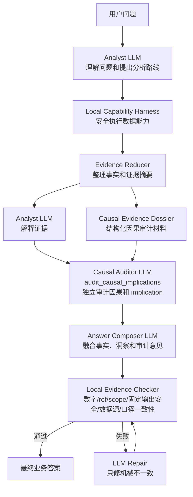

# Causal Auditor LLM Architecture

Version: 2026-07-07.v1

## Why This Changes

The BI agent should reason like an analyst. Causal implication, business mechanism, and "what is worth investigating next" are judgment-heavy. A local rule set can check whether numbers and references are real, but it will be brittle if it tries to decide whether an implication is insightful, plausible, confounded, or worth presenting.

The optimized architecture gives business judgment to LLMs and keeps local code focused on factual consistency.

## Component Roles

### Analyst LLM

The Analyst LLM owns the first-pass business thinking:

- understands the user question and hidden business intent
- proposes hypotheses and analysis routes
- decides whether to ask the user, continue exploration, or stop
- interprets evidence and drafts the answer narrative
- can propose causal or mechanism hypotheses when the evidence makes them worth considering

The Analyst LLM can be imaginative, but every publishable factual statement still needs evidence.

### Causal Auditor LLM

The Causal Auditor LLM independently reviews causal and implication claims. It receives the structured evidence dossier, not just the Analyst answer. Its job is to judge the business meaning of the evidence:

- whether a causal or mechanism explanation is supported, plausible, mixed, confounded, or unsupported
- whether the answer should use proven, likely, candidate, association, or follow-up wording
- which alternative explanations remain credible
- which missing checks would most improve confidence
- which insight can be shown to the user without overstating the evidence

This is an LLM judgment layer. It should not be replaced by local regex or rigid causal-wording rules.

### Local Evidence Checker

The local checker has a narrower role:

- SQL safety
- fixed restricted-output safety and source availability
- schema, metric, grain, and time-window validity
- evidence refs exist
- numbers in claims match evidence payloads
- final text does not publish a stronger claim than the Causal Auditor classification allows

The local checker does not decide whether a mechanism is insightful. It prevents unsupported facts, missing references, restricted-output leaks, and use of unavailable sources.

## Evidence Dossier

The Causal Auditor LLM receives a structured `causal_evidence_dossier`.

```json
{
  "target_claim": "月初付费金额更高可能与发薪日有关",
  "question_family": "pattern_explanation",
  "scope": "全样本",
  "time_window": "2024-01-01..2026-06-30",
  "observed_pattern": {
    "metric": "付费金额",
    "direction": "target_higher | target_lower | mixed | none",
    "effect_size": 0.15,
    "direction_ratio": 0.7,
    "comparable_periods": 30,
    "strength": "high | medium | low | insufficient"
  },
  "temporal_order": {
    "known": true,
    "summary": "候选事件早于或重合于观察窗口"
  },
  "comparison_context": {
    "baseline": "月中和月末",
    "control_or_counterfactual": "none | available | partial",
    "summary": "当前是周期内对比，不是实验对照"
  },
  "segment_consistency": [],
  "event_overlap": [],
  "alternative_explanations": [],
  "negative_evidence": [],
  "missing_evidence": [],
  "data_limits": []
}
```

The dossier is not a proof. It is the shared evidence packet that lets a second LLM audit implication quality.

## Causal Auditor Output

```json
{
  "causal_assessment": "causal_supported | plausible_mechanism | directional_association | candidate_hypothesis | mixed_or_confounded | not_supported | needs_more_evidence",
  "publishable_wording": "可以作为候选解释，不能写成已证明原因。",
  "supporting_reasons": [],
  "main_risks": [],
  "alternative_explanations": [],
  "missing_checks": [],
  "recommended_next_analysis": [],
  "answer_guidance": "最终答案应分开写已验证事实、候选解释和后续观察。"
}
```

The output is business guidance for the answer composer. It is not a local hard gate by itself.

## Workflow Placement

Runtime exposes this step as `audit_causal_implications`. The node takes the
`causal_evidence_dossier` and returns `causal_audit` for answer composition and
local mechanical verification.



## Answer State Model

The old `degrade` bucket is too coarse. Runtime should move toward these answer states:

- `supported_answer`: evidence supports the user hypothesis.
- `negative_answer`: data is sufficient and evidence contradicts or does not support the hypothesis.
- `mixed_answer`: evidence supports part of the hypothesis, with material exceptions or segment differences.
- `candidate_insight`: evidence suggests a mechanism worth mentioning, but it is not proven.
- `needs_clarification`: user boundary can change the conclusion or evidence path.
- `cannot_execute`: SQL safety, source availability, schema, metric contract, grain, or data availability prevents the dependent path from executing.
- `unsafe_to_publish`: answer wording exceeds evidence, references, fixed restricted-output safety, or metric facts and must be repaired.

Local code may detect `cannot_execute` and `unsafe_to_publish`. The LLM judge should classify `supported_answer`, `negative_answer`, `mixed_answer`, and `candidate_insight`.

## Prompt Boundary

Prompts should ask for concise decision notes, not hidden chain-of-thought. The Causal Auditor prompt must:

- treat the Analyst draft as a hypothesis, not authority
- use the dossier and aggregate evidence as source material
- classify causal strength with the allowed labels
- separate observed fact, business implication, candidate mechanism, and missing evidence
- return user-facing Chinese guidance
- avoid raw SQL, internal ids, enum tokens, evidence refs, provider metadata, and other audit-only details in narrative fields

## Local Checker Boundary

The local checker should remain mechanical:

- it may reject a final answer if a numeric value, scope, time window, evidence ref, restricted-output boundary, source reference, or metric id is inconsistent
- it may reject a proven-cause wording when the Causal Auditor output classifies the mechanism below `causal_supported`
- it must not reject a candidate implication only because local rules cannot prove it
- it should return repair feedback to the LLM instead of rewriting the business answer

## Product UX

Replay should show:

- Analyst interpretation
- evidence gathered
- Causal Auditor assessment
- final answer repair if local evidence checking fails

Business users see the natural explanation. Admin/debug views can inspect the dossier, auditor output, refs, and local checker result.
