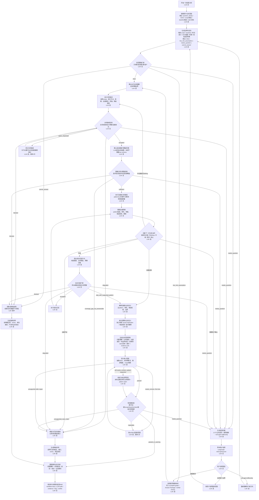

# Phase 4 Agent Workflow Reference

Version: 2026-07-06.v6

This document is the reference for the Phase 4 Agent runtime workflow. Update this file when the main workflow changes.

## Scope

The main workflow is the fixed LangGraph runtime lifecycle for a WAJE BI Agent run. It is not the accepted graph.

- Main workflow: how the Agent runs, loops, asks, repairs, verifies, and persists.
- Accepted graph: the concrete business analysis graph accepted for one user question, including recipe variants, subgraphs, capability nodes, metric, scope, baseline, time window, dependencies, evidence needs, and degraded or skipped paths.
- Run trace: the actual node path, branches, loops, retries, and stop reasons for one run.
- Answer Package: the draft business answer, evidence refs, limitations, verifier result, role visibility, and audit material.

## Main Workflow

## Workflow Rules

- LLM decides business intent, boundary clarity, clarification options, route design, route repair, next analytical action, promotion need, evidence interpretation, causal audit, answer drafting, semantic audit, answer repair, and business-facing degraded or blocked explanation.
- `audit_causal_implications` runs after evidence interpretation and before answer drafting.
- Causal Auditor LLM independently reviews implication and mechanism claims from a structured dossier.
- Local verifier checks refs, numbers, scope, permissions, and auditor wording boundary; it does not decide whether a mechanism is insightful.
- The business intent node must decide `question_family` autonomously from the user question and bound business context. Runtime inputs may pass metric, scope, baseline, target, time window, pattern family, and pattern params as context, but must not pass `question_family`, `question_family_hint`, or a default family into the LLM input. Caller-provided family values can be used only after LLM binding through local compiler or policy validation.
- The analysis route node must decide requested capability nodes from the accepted intent, capability cards, evidence needs, and budget state. Runtime must not pass caller-provided `requested_nodes` as an LLM hint or fallback route.
- Local policy and validators decide hard gates only: contracts, permissions, SQL safety, data coverage, metric/time/grain validity, sample red lines, sparse-cell red lines, budget, evidence completeness, and final hard verifier checks.
- Clarification is a loop. User answers, accepted recommendation, and "tell agent differently" all return to boundary rebinding before analysis continues.
- Route repair is a loop with max 2 repair attempts.
- Answer repair is a loop with max 1 repair attempt.
- Evidence expansion and promotion loops return to the evidence brief before final interpretation, with a hard loop cap before answer synthesis.
- If pattern evidence already supports a bounded answer, missing mechanism, event, outlier, or attribution evidence limits the explanation instead of downgrading the main pattern answer.
- Final `answer_text` must be a business narrative with five parts: question understanding, analysis path, key findings, bounded conclusion, and observable follow-up items or cautions. Hidden reasoning is never exposed; the narrative summarizes the auditable business path and evidence.
- `final_business_summary` is the final user-facing answer text. It is generated after hard verification, or after degraded/blocked explanation, and summarizes the whole auditable run path without exposing hidden reasoning. It must preserve verified claim facts, numbers, scope, and evidence boundaries, while allowing clearly labeled observations or follow-up hypotheses that do not become proven conclusions.
- `claims` remain verifier-friendly evidence assertions. They must keep evidence refs, numbers, scope, time window, and wording boundaries.
- Degraded and blocked explanations are business-visible terminal narratives. They must use business wording for explanation, owner, and repair path; internal field names, capability ids, enum tokens, and evidence refs stay in audit material only.
- If semantic audit still rejects an LLM answer after one repair but the pattern is evidence-supported, local policy can sanitize to a bounded business narrative backed by one local evidence-supported pattern claim before hard verification.
- No local business conclusion fallback is allowed after LangGraph execution failure.
- User-facing process events use business labels. Technical ids, raw SQL, full provider payloads, token metadata, and hidden reasoning stay out of business-reader output.

## SQL Capability Harness

The main workflow plans and executes business analysis through the SQL Capability
Harness reference in `docs/phase-4-sql-capability-harness.md`.

- LLM route planning sees capability cards, evidence summaries, and budget state.
- Local compiler, policy, validators, and capability APIs own SQL compilation,
  physical bindings, permissions, evidence strength, and accepted graph state.
- During R&D, cost mechanism is recorded and visible as tiers, but it does not
  pressure the LLM toward cheaper evidence paths.
- R&D exploration defaults are 50 capability calls for ordinary questions and
  100 for deep attribution. Reaching 100 requires asking the user before further
  exploration.
- Eval cases verify the harness; they do not define the capability catalog.

## Audit Requirements

Admin artifact must include:

- workflow trace with node label, internal node id, status, attempts, branch, failure type, started_at, finished_at, and duration_ms
- LLM call audit with task, provider, model, prompt version, response id, full development messages, required output keys, raw response content, started_at, finished_at, duration_ms, input hash, output hash, usage when available, structured output, and prompt consistency status
- proposed graph, accepted graph, rejected/degraded mutations, repair attempts, and clarification outcomes
- runtime binding status, SQL hash, SQL text, and validator results
- evidence refs, result refs, capability outputs, limitations, and evidence strength
- semantic audit output and hard verifier result
- role visibility decision

## Development Replay

- `/agent-run-workbench` reads persisted runtime and Answer Package records from PostgreSQL.
- `/api/replays` is a development-only parser for historical artifacts and cannot establish current business acceptance.
- LLM events must display visible LLM business output from structured responses; hidden reasoning is not exposed.
- Visible LLM narrative fields must use Simplified Chinese business language for Chinese-based users; machine ids and enum values stay unchanged.
- Tool groups must be inserted at the corresponding local LangGraph nodes, such as route acceptance, data validation, capability execution, hard verification, and artifact persistence.
- Playback timing must use recorded event `duration_ms` and compress the actual run proportionally to a maximum of 10 seconds when timing is available.

Business-reader artifact may include only:

- draft business answer
- aggregate evidence
- visible limitations
- SQL hash
