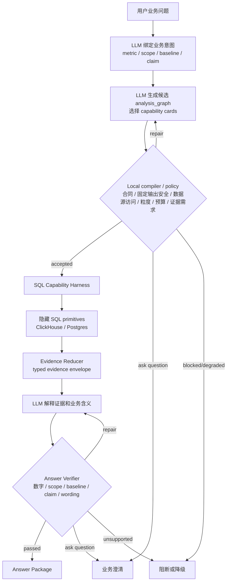

# Phase 4 SQL Capability Harness Reference

Version: 2026-07-06.v1

Status: accepted working reference for the Phase 4 architecture repair.

## Purpose

The SQL Capability Harness is the WAJE-owned execution layer between an accepted
business analysis graph and physical analytical queries. It gives the LLM a
business-readable tool catalog while keeping SQL compilation, physical bindings,
fixed restricted-output checks, source-connection access, evidence strength, and answer verification inside local WAJE
components.

This harness must support the general retrospective `付费金额` problem space. Eval
cases are verification samples only; they do not define the public API surface.

## Boundary



LLM-visible:

- capability card: business purpose, input schema, output schema, supported
  question families, supported grains, evidence type, limitations, cost tier,
  runtime tier, and failure modes
- accepted run state summary: metric, scope, baseline, target, filters, evidence
  already collected, budget state, degraded paths, and missing contracts
- structured evidence summaries and result refs

Hidden from the LLM:

- raw SQL text
- physical table and field names
- connection details, provider settings, secrets, and token metadata
- raw user identifiers, IPs, device ids, and row-level records
- local validator internals beyond business-readable rejection reasons

Admin audit still records SQL text, SQL hash, provider/model, token usage when
available, duration, capability call count, prompt version, response id, and
validator details.

## Layers

1. `Capability Cards`

   Versioned descriptions of business capabilities. These are the only tool
   shapes the LLM can plan against.

2. `Semantic Capability Request`

   A compiler-accepted request with metric, scope, time windows, baseline,
   target, grain, filters, dimensions, claim type, contract pins, role, and
   budget context.

3. `SQL Primitives`

   Internal helpers that compile safe aggregate queries, bind physical fields,
   execute read-only analytical queries, and return aggregate result refs.
   These helpers are not public LLM tools.

4. `Evidence Reducer`

   Capability-specific summarization that computes comparison facts, residuals,
   fit, stability, exception lists, sparse-cell warnings, and evidence strength
   candidates.

5. `Answer Verifier`

   Local checks that every answer claim binds to evidence refs, supported scope,
   metric definition, baseline/target labels, numeric facts, allowed evidence
   type, claim strength, and wording limits.

## Public Capability Catalog

The public catalog uses medium-grained business APIs. Internal helpers may share
query plans or cached aggregate result refs, but the LLM should not call tiny
mechanical operations such as raw bucketing or arithmetic.

| Capability | Purpose | Typical evidence |
| --- | --- | --- |
| `metric_coverage_profile` | Check whether a metric has enough data for a requested scope, grain, and window. | coverage, freshness, missing windows, row/period counts |
| `metric_timeseries` | Produce a reusable aggregate time series for one metric and grain. | result refs, completeness, outlier flags |
| `data_quality_profile` | Review status, dedup, nulls, sparse periods, freshness, restricted-output safety, and source availability. | quality limitations and trust boundaries |
| `compare_periods` | Compare target and baseline periods for a metric. | absolute delta, percent delta, daily average, total, coverage |
| `compare_period_phases` | Compare phases inside a period, such as month start/middle/end. | phase ranking, phase uplift, exceptions |
| `rolling_window_compare` | Compare rolling windows and detect sustained movement. | rolling deltas, stability, trend exceptions |
| `weekday_calendar_compare` | Compare weekday or calendar buckets. | bucket ranking, weekday uplift, coverage |
| `event_window_compare` | Compare windows before/during/after a known event or static assumption. | event-relative deltas, candidate mechanism boundary |
| `formula_decompose` | Decompose a metric into available formula components. | component availability, contribution, reconciliation gap |
| `component_contribution` | Quantify how a component changed between target and baseline. | accounting contribution and residual |
| `segment_breakdown` | Compare metric distribution across one dimension. | segment share, amount, delta, sparse warnings |
| `segment_shift_compare` | Compare segment mix between baseline and target. | mix shift, contribution, unstable segments |
| `candidate_dimension_screen` | Screen eligible dimensions before deeper attribution. | ranked candidates, residual reduction, coverage, sparse risk |
| `joint_attribution` | Test selected dimension combinations. | incremental explanatory power, segment exceptions, stability |
| `outlier_scan` | Identify anomalous periods or segments that affect a claim. | outliers, materiality, dominated periods |
| `change_point_scan` | Detect breakpoints in a metric time series. | candidate change points, confidence boundary |
| `evidence_reduce` | Merge compatible evidence into a claim-ready summary. | evidence strength, conflicts, limitations |
| `answer_verify` | Verify final claims against evidence and contracts. | pass/warn/block result and repair hints |

### Capability Card Schema

```yaml
capability_id: compare_periods
business_name: 周期对比
description: Compare one metric between a target period and a baseline period.
llm_visibility: public_card
input_schema:
  metric: metric_id
  scope: business_scope
  target_period: time_window_with_label
  baseline_period: time_window_with_label
  grain: day | week | month
  filters: optional_filter_set
  claim_type: comparative_change | baseline_stability | business_object_candidate_impact
output_schema:
  evidence_ref: string
  numeric_facts: object
  limitations: list
  result_refs: list
  verifier_handoff: object
supported_question_families:
  - custom_baseline_comparison
  - paid_amount_change_explanation
  - business_object_impact_review
supported_grains:
  - day
  - week
  - month
allowed_claim_types:
  - comparative_change
  - baseline_stability
default_evidence_type: statistical_association
cost_tier: low
runtime_tier: short
preconditions:
  - metric_contract_active
  - target_and_baseline_windows_bound
  - customer_safe_aggregate_output_allowed
failure_modes:
  - coverage_gap
  - unsupported_grain
  - baseline_not_comparable
  - insufficient_periods
```

### Common Request Fields

Every accepted capability request should carry:

- `run_id`
- `accepted_graph_id`
- `graph_version`
- `capability_id`
- `question_family`
- `target_claim`
- `claim_type`
- `metric`
- `scope`
- `time_window`
- `baseline`
- `target`
- `grain`
- `filters`
- `dimensions`
- `contract_versions`
- `role`
- `budget_state`
- `llm_business_reason`

### Common Evidence Envelope Fields

Every evidence-producing capability should return:

- `evidence_ref`
- `capability_id`
- `question_family`
- `target_claim`
- `claim_type`
- `metric`
- `scope`
- `grain`
- `baseline_label`
- `target_label`
- `time_window`
- `numeric_facts`
- `typed_payload`
- `result_refs`
- `sql_hashes`
- `evidence_type`
- `strength`
- `wording_limit`
- `limitations`
- `disabled_degraded_blocked_path_refs`
- `verifier_handoff`
- `admin_audit_ref`

## Exploration Budget Policy

The harness keeps budget as a planning and safety mechanism. During R&D, budget
does not pressure the LLM toward cheaper evidence when a better answer needs
deeper exploration.

LLM-visible budget fields:

```yaml
budget_state:
  mode: research
  used_capability_calls: 12
  soft_limit: 50
  hard_limit: 100
  next_step_cost_tier: medium
  next_step_runtime_tier: normal
  budget_instruction: do_not_trade_answer_quality_for_cost_during_research
```

Admin-only audit fields:

- exact capability call count
- SQL query count
- runtime duration
- model name
- token usage when available
- retries and repair attempts

Default R&D limits:

| Analysis depth | Soft limit | Hard limit | Action at hard limit |
| --- | ---: | ---: | --- |
| ordinary question | 50 capability calls | 100 capability calls | ask user before more exploration |
| deep attribution | 100 capability calls | 100 capability calls | ask user before more exploration |

Budget counting rules:

- Count one capability call when an accepted capability starts execution.
- Local compiler checks, policy checks, route repairs, answer synthesis, and
  verifier checks are audited separately and do not consume capability-call
  budget.
- A capability that fails after execution starts still counts, because it used
  runtime budget and must be visible in audit.
- A blocked request rejected before execution starts does not count, but the
  blocked path is recorded in accepted graph mutation/audit state.

Default stop and escalation rules:

- Stop when current evidence can answer the target claim within allowed wording.
- Stop when new candidates only explain local exceptions; record them as
  exception explanations.
- Stop when candidate uplift, residual reduction, coverage, or stability cannot
  change the main conclusion.
- Degrade when coverage, sample size, sparse cells, fixed output safety, source availability, or contracts are
  insufficient.
- Ask the user when the next step changes scope, baseline, claim type, or
  business action.
- Ask the user when the hard limit is reached.

## Planning And Promotion

The LLM should plan with capability cards and evidence summaries, then return
structured decisions. Local policy applies the decision only if validators pass.

Recommended LLM planning decisions:

- `select_capability`
- `add_capability`
- `disable_capability`
- `repair_params`
- `stop_sufficient`
- `stop_insufficient`
- `degrade_to_exception`
- `promote_to_higher_order`
- `request_missing_contract`
- `ask_question`

Promotion to higher-order attribution should follow local candidate screening:

1. `candidate_dimension_screen` tests eligible dimensions and records ranked
   summaries.
2. LLM promotion judge reviews the ranked summary, residual summary, business
   plausibility, evidence strength, sparse warnings, and budget state.
3. Local policy accepts, repairs, degrades, or rejects the proposed promotion.
4. `joint_attribution` runs only for accepted candidates.

The first implementation can use static capability cards in repo files and
in-memory request/evidence objects. Later persistence can move the same contract
shape into Postgres without changing the LLM-visible boundary.

## Phase 4 Integration

Current Phase 4 runtime should migrate toward this harness in four cuts:

1. Add capability card registry and request/evidence dataclasses.
2. Wrap existing `data_quality_check`, `pattern_scan`, `formula_decompose`,
   `event_evidence`, `segment_bridge`, `joint_attribution`, `outlier_scan`, and
   `answer_verify` behind harness calls.
3. Add general comparison capabilities, starting with `compare_periods`,
   `compare_period_phases`, `weekday_calendar_compare`, and
   `rolling_window_compare`.
4. Feed LLM route planning with capability cards and budget state; feed answer
   synthesis/verifier with normalized evidence envelopes.

The first cut should preserve existing Phase 4 eval behavior while improving
question alignment, baseline labels, and evidence refs. New eval failures should
be attributed to the system responsibility point that produced them: LLM
reasoner, graph compiler, semantic compiler, capability API, evidence reducer,
answer synthesizer, answer verifier, or visualization planner.

## Non-Goals

- Generic raw SQL tool exposed to the LLM.
- One all-in business API that hides graph planning and evidence gaps.
- Production pricing policy.
- Full persistence schema migration.
- Frontend replay redesign.
