# WAJE BI Agent vNext Gate 3：Universal Measurement Authority

## 0. 文档控制

| 项目 | 内容 |
|---|---|
| 日期 | 2026-07-30 |
| 状态 | Planned；组合对抗式审查已合并，生产实现尚未开始 |
| Gate | 3 |
| 前置代码基线 | Gate 2 commit `01c28dbf795e2d6b0b2272c1c46b4cfa96aab453` |
| Entry interview | 本 Gate 无需用户决策 |
| Entry 理由 | 用户已确认开放业务日期与测量语义由 Primary Agent 自主设计；确定性系统验证结构、日历、合同、证据、状态与发布安全 |
| Gate 0–2 审计 | `docs/reviews/2026-07-30-bi-agent-vnext-gate-0-2-realignment-audit.md` |
| 对抗式审计 | `docs/reviews/2026-07-30-bi-agent-vnext-gate-3-plan-adversarial-review.md` |

Gate 1 与 Gate 2 的历史验收事实继续成立。G3.1、G3.2 是进入 Gate 3 业务闭环实现前的
强制修订包；在这两个包完成前，不创建新的生产 EvidenceRecord、AnswerVersion 或 Workflow
业务投影。

## 1. Gate 目标

Gate 3 建立一个通用的 measurement-authority kernel，使 Primary Business Analysis Agent
能够把开放经营问题转换成可追溯、可执行、可证伪的测量设计，并让这一设计在整个调查链路
保持同一语义。

Gate 3 不以某道比较题作为产品边界。“目标月月初 vs 前月月末”保留为历史失败回归项，
同时覆盖定义、估计、趋势、构成、分解、cohort、funnel、分布、关联、因果挑战、数据质量
和开放诊断。

每个评测样本必须预先声明：

- `required_disposition`；
- `allowed_dispositions`；
- 允许的 boundary code；
- 支持该 disposition 的 contract 或 expectation evidence；
- 该样本是否被标记为 `contract_supported`。

系统最终只能产生 expectation package 允许的结果：

1. source-grounded、typed、可执行、可证伪的 accepted measurement design；
2. 会改变业务含义的一次一个澄清问题，带推荐解释与影响；
3. 可审计的 data contract、identification、privacy 或 evidence boundary。

`contract_supported=true` 的样本必须形成 executable design。boundary 无权掩盖 binding、
provider、compiler、runtime 或 trace failure。

## 2. 旧 Gate 3 的撤销边界

commit `1f818267` 引入的 Gate 3 生产代码、合同变化、测试、acceptance tools、Workflow
projection、语义 fixture 和生成 artifact 已全部从当前工作树撤销。错误的同月
`1–7 vs 8–月底` EvidenceRecord、reversal、settled Answer 和 completed Workflow 全部失效，
不作为兼容输入、回归 gold 或数据迁移来源。

撤销代表一类通用失败：

`source-to-measurement authority drift`

旧实现同时暴露了以下结构性问题：

- planning 输入已经改变原始问题；
- scripted agent 按 turn 交付预制对象，未证明真实模型理解；
- ID 连续被误当成语义连续；
- calendar、exposure、comparison identity 无法机械验证；
- verifier 缺少同一 estimand 的可证明适用范围；
- tool success、Evidence 存在、settled publication 与 case delivery 被压成一个完成状态。

## 3. Gate 边界

### 3.1 Gate 3 交付

- immutable QuestionRevision lineage 与跨阶段 correction 接纳；
- source-grounded strict SemanticBinding；
- 可组合、条件完备的 AnalysisFrame measurement graph；
- 明确可寻址的 `EstimandSpec` 与 `ClaimTargetKind`；
- deterministic measurement validation、calendar/data resolution 与 derivation proof；
- `EvidenceRequirementSpec` 到 `ResolvedEvidenceObligation` 的单向编译；
- versioned canonical identity、typed scope algebra 与 evidence compatibility proof；
- Frame candidate review saga、checkpoint/resume、CAS 与并发 fencing；
- WorkPlan 的业务调查合同与 `QueryBindingEnvelope`；
- capability result 到 Evidence admission 的原子恢复协议；
- provisional Answer 的 identity precheck 与 Gate 3 settlement hard deny；
- execution、obligation、publication、delivery 四轴 Workflow contract；
- WAJE-owned trace、eval manifest、replay、mutation、property 与 real-provider acceptance。

### 3.2 后续 Gate 责任

| Gate | 责任 |
|---|---|
| Gate 4 | 生产 capability fabric、物理 QuerySpec compiler、数据源/字段/join/filter 映射、SQL escape hatch、stable result handle、真实数据准确性 |
| Gate 5 | 数字/单位/分母/文字方向 verifier、Answer Reviewer、claim-level settle policy、局部降级与 publication |
| Gate 6 | Chat + Analysis + Workflow 双栏 Workbench 与证据展开 |
| Gate 7 | 核心问题家族 launch matrix、全量 provider/data/UI/release acceptance、删除旧实现后的发布演练 |

Gate 3 定义 Gate 4 必须消费的 logical query binding。Gate 3 不生成生产物理 QuerySpec，也不
用 conformance executor 冒充真实数据能力。Gate 3 可以在隔离测试 realm 验证全链路合同，
该 realm 的结果不能进入 production EvidenceStore。

## 4. 顶层不变量

1. Primary Business Analysis Agent 持续拥有开放业务语义。
2. `QuestionRevision` 保存用户输入 lineage；它不承载 estimand。
3. `AnalysisFrameRevision` 是测量设计唯一权威。
4. 每个 estimand 都由显式 `EstimandSpec` 寻址，任何下游对象不能引用“整个 Frame”来回避
   具体 estimand。
5. Frame 保存 `EvidenceRequirementSpec`；deterministic compiler 只生成
   `ResolvedEvidenceObligation`，下游无权反向修改 Frame。
6. 日期、metric、population、unit、denominator、exposure、contrast、estimator、
   eligibility、identification 任一实质变化都要求 FrameRevision。
7. snapshot/release/calendar 的确定性解析形成 immutable resolution；accepted WorkPlan 是
   采用某个 resolution 的唯一入口。
8. capability 只能执行 accepted `QueryBindingEnvelope` 指定的 logical measurement。
9. physical QuerySpec 无权增加业务语义。
10. Evidence 必须记录实际 scope、exposure、data version 与同一 resolution。
11. claim applicability 必须可证明为 Evidence supported scope 的合法关系。
12. 技术 retry 保持 business identity、logical execution identity 与 idempotency identity。
13. 用户纠正会移动 accepted question head，并 fencing 旧 review、plan、effect 与 Evidence。
14. Reviewer 只输出结构化异议；Primary Agent 继续拥有 Frame。
15. 所有 material semantic assertions 都经过独立 semantic consistency pass。风险等级决定
    审查深度与是否逐项展开，不能决定跳过校验。
16. Workflow 不使用单一 `completed` 表达多个生命周期轴。
17. Gate 3 在 repository、controller、database constraint 和 projection 层共同拒绝
    `settled`。
18. 用户身份不进入 dataset、measurement、capability、evidence strength 或 settlement
    判定。
19. question family 只用于 eval coverage，不参与 runtime 关键词路由。
20. strict schema 证明输出形状；source grounding、业务一致性、合同兼容和证据适用范围分别
    由独立校验层负责。

## 5. 权威链

```mermaid
flowchart LR
    Q["Accepted QuestionRevision"] --> B["Strict SemanticBinding"]
    B --> FC["Durable FrameCandidateBundle"]
    FC --> MR["MeasurementObjection set"]
    MR --> F["Accepted AnalysisFrameRevision"]
    F --> ER["EvidenceRequirementSpec"]
    F --> R["ResolvedMeasurementInstance"]
    ER --> O["ResolvedEvidenceObligation"]
    R --> O
    R --> P["Accepted WorkPlanRevision"]
    O --> P
    P --> QB["QueryBindingEnvelope"]
    QB --> C["CapabilityResultEnvelope + immutable EvidenceRecord"]
    C --> E["EvidenceAdmissionRecord"]
    O --> E
    C --> AU["EvidenceUseBinding"]
    E --> AU
    AU --> CL["AnswerClaim"]
    CL --> A["Provisional AnswerVersion"]
    P --> W["Workflow projection"]
    O --> W
    E --> W
    A --> W
```



accepted heads 只从 `InvestigationCase` CAS row 读取。candidate、effect、Evidence admission
分别从自己的 durable record 恢复；checkpoint 只恢复 controller interruption state。
journal 提供有序事实索引、projection 和一致性验证，不能重建、覆盖或自动修复 head。
head/event 不一致时 fail closed 并进入审计。

## 6. QuestionRevision 与 conversation correction

### 6.1 QuestionRevision

`QuestionRevision` 属于 `InvestigationCase` authority family：

- `question_revision_id`、`case_id`、`revision_number`、`prior_question_revision_id`；
- immutable `source_message_refs`；
- message role、sequence、content hash 与服务端原文；
- 用户明确 scope、constraint、correction、challenge；
- accepted clarification refs；
- acceptance event、accepted question head version；
- `analysis_cycle_id`。

LLM 的问题改写保存在 SemanticBinding，不能替代 source message。

### 6.2 跨阶段消息接纳

controller 提供统一 `submit_user_message`。除依法封存的 case 外，它可在 READY、
WAITING_FOR_EFFECT、WAITING_FOR_MEASUREMENT_REVIEW、WAITING_FOR_EVIDENCE_ADMISSION 和
历史 run 已结束后接纳新消息。

开放 message impact 使用 durable LLM saga：

1. 第一个短事务幂等持久化 `MessageIngressRecord` 与 `PendingUserMessage`，创建 input epoch，
   并把该 case 的新 Frame/Plan/Evidence/Answer admission 暂停在
   `WAITING_FOR_MESSAGE_BINDING`；
2. in-flight effect 可以完成并持久化 result receipt，Evidence admission 保持 pending；
3. 事务外由 Primary Agent 产生 strict `MessageImpactBinding`，绑定 message hash、accepted
   question head 与 expected head version；
4. 独立 semantic consistency pass 检查 impact binding；
5. 第二个短事务在 question-head CAS 上采用
   `explain_existing | revise_question | ask_clarification`；
6. crash/resume 重用同一 pending message、provider invocation 和 impact candidate。

`explain_existing` 会创建 immutable explanation-request binding，使后续 Answer 能证明响应了
哪条 follow-up。controller 不使用关键词或本地 classifier 判断开放 message impact，LLM
调用也不跨数据库事务。

MessageImpactBinding 的业务规则：

- 只要求解释现有 Evidence，且不改变 claim scope：继续当前 QuestionRevision；
- 改变目标、scope、业务定义、时间含义、约束或明确纠正：创建 QuestionRevision；
- 无法安全判定是否 material：Primary Agent 提出一次一个澄清。

新 QuestionRevision 的 CAS 事务必须：

1. 验证 expected accepted question head；
2. 创建 revision 并移动 question head；
3. 清空当前 Frame/Plan/Answer heads；
4. 标记旧 candidate、review、pending effect 和待接纳 result 为 superseded；
5. 写 journal、checkpoint 与新 analysis cycle；
6. 保留旧 attempt/result receipt 供审计。

已启动的外部 effect 可以完成，但返回结果必须携带原 question/frame/binding identity；
Evidence admission 在 identity mismatch 时拒绝。已结束 run 上的 material follow-up 在同一
case 创建新 analysis cycle 和新 run，旧 run 保持历史可重放。

并发测试至少覆盖 correction-vs-effect、correction-vs-review、correction-vs-answer、
crash-after-message-ingress、effect-before-binding、crash-after-question-CAS、duplicate
ingress 和 explanation-follow-up replay。

## 7. Strict LLM binding、action 与 Reviewer

### 7.1 SemanticBinding

Primary Agent 先产生 strict `SemanticBinding`：

```text
SemanticBinding
├── question_revision_id
├── business_goal
├── requested_decisions_or_outputs[]
├── semantic_assertions[]
│   ├── assertion_id
│   ├── concept
│   ├── proposed_binding
│   ├── material_fields[]
│   └── support_refs[]
│       ├── source_message_span
│       ├── decision_record
│       ├── semantic_contract
│       └── agent_inference
├── unresolved_material_ambiguities[]
└── candidate_measurement_shapes[]
```

`source_message_span` 包含 message ID、Unicode code-point start/end、selected-text hash。
deterministic validator 从 immutable source 重取文本并验证 range/hash。

每个 material assertion 必须有可重放支持：

- source message；
- accepted DecisionRecord；
- versioned semantic/data contract；
- 明确标记风险、可逆性和替代解释的 agent inference。

低风险推断进入 DecisionLedger，并被 accepted Frame 引用。选择会改变结论、baseline、时间
语义、安全边界、claim strength 或显著执行成本，且无法从 source、contract、data
availability 查明时，Primary Agent 一次只问一个问题，给出 2–3 个业务选项、推荐解释、
影响与自由纠正入口。

### 7.2 Provider 输出合同

- SemanticBinding 与 MeasurementObjection 使用 strict Structured Outputs；
- typed actions 编译成独立 strict function tools，每个 action 一个 schema；
- 每一步只允许一个 tool call；
- `parallel_tool_calls=false`；
- 不提供 JSON mode 或自然语言解析 fallback；
- provider/model 在运行前通过 strict-schema feature preflight；
- application 处理 refusal、incomplete、content filter、multiple calls、unknown tool、
  truncated arguments 与 schema mismatch；
- provider timeout/retry 集中在统一 provider layer；
- 高价值调用在未配置正数 timeout 时等待真实回答完成。

每次调用形成 immutable `ModelInvocationRecord`，见第 18 节。

### 7.3 独立 semantic consistency pass

合法 span 仍可能支持相反含义。每个 identity-affecting assertion 在 Frame acceptance 前都要
经过独立 consistency pass：

- source assertion 与 proposed binding 是否同义或有明确推断桥梁；
- Frame node 是否保留 assertion 的方向、范围、时间锚点、单位与强度；
- contract grounding 是否存在且版本一致；
- alternatives 是否被诚实记录；
- unsupported semantics 是否被明确标成 ambiguity 或 boundary。

低风险 assertion 可以批量审查；高风险 assertion 使用独立上下文逐项审查。审查调用与
Primary Agent 调用分离，不能复用其隐藏上下文或让它自评通过。

### 7.4 Durable Frame candidate review saga

Frame acceptance 前先持久化未接受的 `FrameCandidateBundle`：

- candidate ID、candidate hash；
- question head、expected head version；
- SemanticBinding hash；
- proposed graph；
- deterministic validation result；
- review request；
- ModelInvocationRecord ref；
- MeasurementObjection set；
- disposition state。

candidate hash 包含 proposed graph、binding/DecisionRecord refs、deterministic proof 与
review context hash。任何用于关闭 objection 的新业务事实都会生成新 candidate hash。

状态机至少包含：

```text
CANDIDATE_RECORDED
→ WAITING_FOR_MEASUREMENT_REVIEW
→ REVIEW_RECEIVED
→ WAITING_FOR_PRIMARY_DISPOSITION
→ READY_FOR_FRAME_CAS
→ ACCEPTED | SUPERSEDED | REJECTED
```

Reviewer 通过 outbox/effect 运行，不能跨越数据库事务持有 lease。review request/result 都
绑定 candidate hash、question head 和 expected head version。crash/resume 从同一 candidate
继续；最终 CAS 重算 objection closure proof，只接受 `blocking_objection_count=0` 或所有
blocking objection 都有 system-verified closure record 的 candidate hash。

Reviewer 只输出 `MeasurementObjection`：risk、severity、assertion/frame refs、conflict、
requested action、status 与 disposition。它不能提交 Frame、WorkPlan 或 Answer。

Reviewer 创建 immutable objection。Primary Agent 只能提交 response proposal，不能直接写
resolved。blocking closure 只允许：

- 修订 graph/binding，生成引用旧 candidate/objection 的新 candidate hash，并完整重跑
  deterministic validation 与独立 review；
- 用户决定形成 accepted DecisionRecord，生成引用该决定的新 candidate hash并重新 review；
- 新 deterministic proof 进入 candidate context，生成新 candidate hash，由独立 Reviewer
  recheck 原异议是否为 false positive；
- Frame 转为 typed boundary 或 rejected candidate，并满足 expectation package。

non-blocking objection 才允许经记录理由接受风险。任何 material graph 变化都使旧 review
失效。

## 8. AnalysisFrame measurement algebra

### 8.1 顶层结构

每个 `AnalysisFrameRevision` 包含：

- `QuestionGrounding`；
- `DecisionObjective`；
- 一个或多个显式 `EstimandSpec`；
- frame-level assumptions、alternatives、sensitivities、falsification、reversal；
- `EvidenceRequirementSpec` 集合；
- epistemic completion 与 claim boundary；
- source/decision/contract grounding；
- identity references 与 versioned canonical preimages。

`EstimandSpec` 至少包含：

- `estimand_id`；
- `claim_target_kind`；
- variable/event/sequence references；
- applicable population、observation、time、estimator、exposure、contrast、identification
  references；
- required EvidenceRequirementSpec refs；
- alternatives、sensitivity、falsification、reversal refs；
- scope ceiling 与 claim strength ceiling。

### 8.2 ClaimTargetKind

`ClaimTargetKind` 是开放组合图的 typed claim target；问题家族 router 不参与 runtime：

- `definition`；
- `data_quality_state`；
- `point_quantity`；
- `distribution`；
- `temporal_pattern`；
- `contrast`；
- `composition`；
- `accounting_decomposition`；
- `cohort_outcome`；
- `funnel_transition`；
- `association`；
- `causal_effect`；
- `diagnostic_set`。

每类 target 使用条件 validator。definition 和 data-quality target 不被强迫拥有无意义的
Population/Estimator；它们仍须声明概念范围、合同版本、验证对象与证据要求。

### 8.3 组合节点

| 节点 | 内容 |
|---|---|
| `QuestionGrounding` | QuestionRevision、source spans、DecisionRecord、contract refs |
| `DecisionObjective` | 用户要理解、判断或选择什么；排除自动行动 |
| `VariableSpec` | metric/concept、data type、unit、formula、role |
| `EventSpec` | event identity、event time、entity key、qualifying predicate |
| `PopulationSpec` | entity universe、inclusion/exclusion、sampling frame |
| `ObservationUnitSpec` | row/entity/time unit、grain、dedup identity |
| `MetricExpression` | numerator、denominator、aggregation、unit algebra |
| `TemporalSemanticSpec` | event/accounting/ingestion/snapshot time roles |
| `WindowRuleSpec` | relative/absolute rule、anchor、offset、selection、boundary |
| `EstimatorSpec` | estimator family、weights、aggregation order、uncertainty |
| `ExposureSpec` | calendar/eligible/observed/valid exposure 与 normalization algebra |
| `ContrastSpec` | operands、pairing、direction、difference/ratio/index |
| `SequenceSpec` | ordered stages、entity continuity、transition timeout、denominator dynamics |
| `CohortRiskSetSpec` | entry event、time origin、horizon、at-risk rule、censoring |
| `ReconciliationSpec` | accounting identity、allocation rule、residual、reconciliation tolerance |
| `RelationshipSpec` | exposure、outcome、confounders、adjustment、temporal order |
| `EligibilitySpec` | period completeness、coverage、missingness、exclusion/degrade |
| `IdentificationSpec` | descriptive/associational/accounting/causal level 与 assumptions |
| `AlternativeSpec` | material alternative、test、status policy |
| `SensitivitySpec` | changed node set、derived relation、expected evidence relation |
| `FalsificationSpec` | 能否反驳当前设计的观测或合同条件 |
| `ReversalSpec` | 改变方向、强度或结论所需结果 |
| `EvidenceRequirementSpec` | Frame-owned evidence closure requirement |
| `EpistemicCompletionSpec` | 何时可回答、降级、暂停或声明边界 |

### 8.4 条件完备规则

所有 graph 都必须通过：

- IDs/refs 唯一且存在；
- material node 可从 QuestionGrounding 到达某个 EstimandSpec；
- 每个 EstimandSpec 到达 EvidenceRequirementSpec 与 EpistemicCompletionSpec；
- unit、grain、scope 与 time roles 类型一致；
- graph 有界；execution dependency 保持 DAG；
- opaque material free text 不能替代 typed node。

形状专属规则：

- ratio/rate：明确 numerator、denominator、risk/eligibility set、aggregation order；
- contrast：至少两个有角色、方向和 pairing 规则的 operand；
- time-dependent measure：TemporalSemanticSpec、WindowRuleSpec 与 ResolutionContext；
- cohort：entry event、time origin、horizon、risk set、censoring；
- funnel：ordered stages、entity continuity、transition window、dynamic denominator；
- decomposition：accounting identity、allocation、residual 与 reconciliation；
- association：exposure、outcome、temporal order、adjustment set 与 interpretation ceiling；
- causal effect：treatment、outcome、counterfactual estimand、exchangeability/positivity/
  consistency/interference assumptions 与识别边界；
- data quality：被检查的 contract、coverage/completeness/validity target 和判定规则；
- diagnostic set：多个可寻址 estimand、alternatives 与 closure path。

causal contract 不完整时只能生成 associational design 或 typed identification boundary。

### 8.5 Frame 与 Plan 的停止条件

Frame 只拥有认识论条件：

- 何时 evidence 足以回答某个 estimand；
- 何时只能降级 claim strength；
- 哪些 falsification/reversal 会改变结论；
- 哪些 boundary 终止可支持的 claim。

WorkPlan 只拥有执行条件：

- task dependency closure；
- retry/cost/time/resource budget；
- scheduling 与 capability availability；
- 何时暂停执行并请求 Frame/Plan revision。

Plan 无权通过“停止条件”降低 Frame 的 evidence requirement。

### 8.6 Open-world extension

measurement algebra 把业务概念与测量运算分开：

- 新 metric、dimension、event、entity 和业务日历通过 versioned semantic/data contract
  接入；
- 已有 operator 可以自由组合，不按 question family 选择固定模板；
- 新 estimator、identification regime 或 scope relation 需要新增 versioned typed operator、
  validator、identity preimage 和 eval vectors；
- schema 尚未表达的新语义返回 `unsupported_measurement_algebra` boundary，并保留完整
  grounding；不能塞进 `notes`、SQL 参数或 capability payload。

这使当前与未来 BI 问题沿统一扩展机制演进。扩展单位是可复用的测量原语和证据合同，
不以单句问题或单个客户 case 建分支。

## 9. 时间、日历、数据版本与 exposure

### 9.1 四层时间模型

1. `TemporalSemanticSpec`：业务问题使用 event time、accounting time、ingestion time 或
   snapshot time 的哪一种；
2. `WindowRuleSpec`：relative/absolute anchor、period offset、selection rule、boundary；
3. `ResolutionContext`：`as_of_instant`、timezone、business-day cutoff、calendar version、
   holiday version、fiscal version；
4. `DataVersionSpec`：contract version、snapshot/release、coverage watermark、late-arrival
   policy。

无时间维度的定义题仍绑定 semantic/data contract version。任何查询不得用 ingestion time
悄悄替代 business event time。

### 9.2 WindowRuleSpec

支持：

- absolute interval；
- relative calendar anchor；
- month/quarter/week/year/fiscal/business-calendar offset；
- start/end ordinal；
- first/last-N calendar days；
- first/last-N valid business days；
- rolling interval；
- inclusive/exclusive boundary；
- pairing key；
- selection rationale 与 grounding。

开放日期语义由 typed LLM 提出。deterministic resolver 只解析 accepted rule，并验证日历
合法性、覆盖与合同。

### 9.3 ResolvedMeasurementInstance

deterministic resolver 先产生 system-owned、immutable `MeasurementResolutionOutcome`：

- `resolved_instance`：包含可执行 ResolvedMeasurementInstance；
- `typed_resolution_boundary`：包含 boundary code、failed requirement/contract refs、
  inspection evidence、derivation proof 和 allowed-claim ceiling。

两种 variant 都有 outcome ID/hash，且没有独立 accepted head。missing contract、
unsupported measurement algebra、calendar/data version 无法解析时使用 boundary variant，
不能伪造 dates、snapshot 或 instance ID。

resolved instance 是内容寻址、确定性派生的 immutable record：

- `resolution_id`；
- semantic measurement identity；
- accepted Frame、EstimandSpec 与 authority binding；
- `as_of_instant`；
- target period；
- 每个 window 的 anchor、offset、actual start/end；
- actual calendar days；
- timezone、cutoff、calendar/holiday/fiscal versions；
- DataVersionSpec 与 coverage boundary；
- expected grain、expected exposure、eligibility；
- field-level derivation proof。

resolver 只能消费 accepted Frame 的 snapshot policy、versioned calendar/data contract 与
release resolver。持久化必须幂等。accepted WorkPlan CAS 会重算 derivation proof，并成为
采用 resolution outcome 的唯一入口。

相同 Frame 在 snapshot policy 不变时可以解析出新 resolution。snapshot 选择本身改变业务
含义、eligibility、coverage interpretation 或时间口径时创建 FrameRevision。

### 9.4 ExposureSpec 与聚合代数

ExposureSpec 明确区分：

- calendar exposure；
- eligible exposure；
- observed exposure；
- valid exposure；
- missing/invalid exposure；
- at-risk exposure。

同时声明：

- exposure unit；
- numerator/denominator unit；
- zero/missing policy；
- weighting；
- ratio-of-sums、mean-of-ratios 或其他 aggregation order；
- pairing 与 comparability rule；
- minimum coverage 与 degrade/exclude policy。

Evidence 记录实际 observed/valid exposure 和 missingness。窗口长度或有效 exposure 不等且
问题要求强度可比时，业务方向 claim 使用 Frame 指定的 normalized estimator。raw total
只能支持 total estimand，或作为标明 length effect 的辅助证据。

calendar/property tests 覆盖 28/29/30/31 天、闰年、跨月/季/年、DST、holiday version、
不同窗口长度、缺失/重复日期、snapshot 中途结束、late arrival、partial coverage 与
incomplete period。

## 10. Canonical identity 与 derivation

### 10.1 身份层

| 身份 | versioned preimage | 用途 |
|---|---|---|
| `semantic_measurement_id` | normalized Estimand AST + material semantic/metric contract versions | 同义问题共享测量语义 |
| `authority_binding_id` | QuestionRevision + FrameRevision + EstimandSpec + grounding/Decision refs | 证明谁在何处采用该测量 |
| `resolution_outcome_id` | semantic measurement + resolver inputs + resolved instance 或 typed boundary | 证明解析结果 |
| `resolution_id` | resolved outcome 的 as-of + calendar/data versions + resolved operands | 证明实际日期与数据版本；boundary variant 无此 ID |
| `logical_execution_id` | accepted Plan task + obligation + QueryBindingEnvelope | 证明业务执行意图 |
| `query_spec_id` | Gate 4 production physical QuerySpec preimage | 证明生产物理查询 |
| `capability_invocation_id` | tagged execution provenance + idempotency inputs | 证明一次可恢复调用 |

Evidence 绑定 resolution outcome、execution provenance 与原始 authority provenance。
execution provenance 使用封闭 tagged union：

- `ConformanceExecutionProvenance`：logical execution ID、ConformanceExecutionSpec
  ID/hash、trusted test realm；
- `PhysicalQueryExecutionProvenance`：logical execution ID、QuerySpec ID/hash、production
  capability invocation。

### 10.2 Preimage 规范

每个 ID 有独立 schema 与 `identity_algorithm_version`。preimage 明确排除自身、全部 derived
hash/ID、timestamps、transport metadata 和 display labels。

跨语言 canonical codec 规定：

- UTF-8 与 Unicode normalization；
- object key 排序；
- set-like array 的稳定排序和 sequence array 的顺序保留；
- explicit null；
- canonical decimal string，金额/比率禁止 binary float；
- timestamp 统一 offset、precision 与 timezone representation；
- interval boundary representation；
- enum casing 与 unit canonicalization。

Python 和 TypeScript 各有实现，共享 golden/mutation vectors。`transport_schema_version` 与
`identity_algorithm_version` 分离，新增非实质 transport 字段不改变 measurement identity。

计算顺序固定为：

```text
normalized estimand AST
→ semantic_measurement_id
→ accepted FrameRevision
→ authority_binding_id
→ deterministic resolution outcome
→ resolution_outcome_id
→ resolved branch resolution_id
→ accepted Plan adoption
→ logical_execution_id
→ conformance_execution_spec_id | Gate 4 query_spec_id
```

### 10.3 Evidence reuse

EvidenceRecord 本身保持创建时的 authority provenance。新 Frame 想采用旧结果时创建
immutable `EvidenceUseBinding`，它必须证明：

- semantic measurement compatible；
- resolution/data version compatible；
- supported scope 满足新 requirement；
- strength 与 limitation 满足新 claim ceiling；
- 原 Evidence 的最新 `EvidenceValidityRecord` 允许使用。

harmless Frame metadata change不会重写 EvidenceRecord。任何无法证明的 reuse fail closed。

`EvidenceValidityRecord` 是 system-owned、append-only disposition：

- Evidence ID、prior validity record；
- admitted_valid/never_admitted/superseded/revoked 状态；
- reason、source authority、policy/version；
- CAS currentness 与 content hash。

EvidenceUseBinding 只可从 accepted admission + latest admitted_valid + compatibility proof
确定性派生。任何状态变化都新增 record，不修改 EvidenceRecord。

## 11. Typed scope algebra

自由文本 applicability 无法支持 subset proof。Gate 3 定义封闭 `ScopeExpression`：

- entity universe ref；
- typed dimension domains；
- time interval set；
- predicate AST；
- grain；
- unit；
- aggregation path；
- population/risk-set ref；
- data version boundary。

scope engine只证明：

- exact equality；
- subset/superset；
- lawful projection；
- lawful aggregation；
- disjoint；
- unknown。

opaque predicate 或无法证明的关系返回 `unknown` 并阻止 claim publication。Evidence
compatibility 同时验证 scope、unit、grain、aggregation path、resolution 与 exposure。

## 12. Evidence requirement 与 obligation

### 12.1 单一所有权

Frame 中的 `EvidenceRequirementSpec` 定义业务需要什么：

- target EstimandSpec / claim shape；
- required evidence types；
- AND/OR composition；
- minimum strength；
- scope/coverage/exposure constraints；
- contradiction handling；
- boundary policy；
- falsification/reversal linkage。

deterministic compiler 生成 `ResolvedEvidenceObligation`：

- obligation ID；
- requirement ID/hash；
- resolution outcome ID；
- field-level derivation proof；
- immutable closure definition。

compiler不能增加或降低 requirement。一个 requirement 可以解析成多个 obligation；每个
obligation 都能追溯到唯一 requirement。

ResolvedEvidenceObligation 不保存 mutable fulfillment state。fulfillment 从 accepted
EvidenceAdmissionRecord、EvidenceUseBinding、typed boundary outcome 与 contradiction
disposition 确定性投影。需要缓存时写 append-only `ObligationSatisfactionRecord`，绑定完整
输入集合、verifier policy 和 content hash；新 Evidence 产生新 record，repository/DB 禁止
修改 obligation definition。

### 12.2 闭环

WorkTask 必须显式声明关闭哪些 obligation。Plan acceptance validator 检查：

- 每个 required obligation 有 closure path；
- boundary task 只能使用 Frame 允许的 boundary policy；
- alternative/sensitivity/falsification obligation 没有被遗漏；
- execution budget 不会静默降低 evidence minimum。

boundary claim 必须绑定 EvidenceRequirementSpec、typed resolution boundary outcome、
contract inspection evidence、allowed boundary code 与 obligation satisfaction projection，
使 boundary 也留在 requirement → outcome → obligation → claim 权威链中。

## 13. WorkPlan 与 Gate 4 query 边界

### 13.1 WorkPlan

WorkTask 表达业务调查：

- business purpose；
- target estimand/claim；
- authority binding 与 resolution outcome refs；
- obligation refs；
- capability intent；
- dependencies；
- execution success/degrade/stop conditions；
- cost/resource class。

Plan 不复制 metric、window、denominator 或 exposure。UI 需要展示时从 accepted Frame 和
resolution projection 读取。

### 13.2 QueryBindingEnvelope

Gate 3 只为 `resolved_instance` outcome 建立 logical `QueryBindingEnvelope`：

- authority binding ID；
- resolution outcome 与 resolution ID/hash；
- obligation IDs；
- required variables/events/dimensions；
- expected scope、grain、unit、exposure；
- permitted aggregation algebra；
- capability intent；
- execution-only option allowlist；
- semantic preservation requirements。

Gate 4 deterministic compiler 消费此 envelope 与 physical contracts，生成 QuerySpec：

- source、field、join、filter、grouping；
- safe SQL/parameterization；
- physical execution budget；
- field-level semantic preservation proof；
- QuerySpec ID/hash。

sampling、limit、approximation、null policy 或其他会改变 estimator/strength 的选项必须来自
Frame/resolution；它们不能伪装成 execution-only option。

Gate 3 conformance harness 只使用 `ConformanceExecutionSpec` 验证 envelope continuity，
不会生成生产 QuerySpec。

## 14. Capability result 与 Evidence admission

capability 原生返回 immutable typed `CapabilityResultEnvelope`，其中包含完整、不可变的
`EvidenceRecord`：

- invocation/result IDs；
- QueryBindingEnvelope 与 tagged execution provenance；
- result handle 或 bounded payload；
- actual scope、grain、unit、date range；
- actual observed/valid/missing exposure；
- snapshot/release/contract refs；
- strength/limitations；
- capability-native EvidenceRecord；
- immutable result hash。

其中 EvidenceRecord 至少绑定：

- Evidence ID、case/run 与 environment realm；
- QuestionRevision、FrameRevision、EstimandSpec、authority binding；
- semantic measurement、resolution outcome、logical execution 与 tagged execution identity；
- EvidenceRequirementSpec 与 ResolvedEvidenceObligation；
- comparison/operand/window identity；
- actual start/end、timezone、business-day boundary 与 data version；
- actual population、typed scope、grain、unit、aggregation path；
- expected/observed/valid/missing/at-risk exposure；
- estimate、uncertainty、strength、limitations；
- result handle、capability/compiler/provenance refs 与 immutable content hash。

EvidenceRecord 本身不保存 `accepted=true/false`。system-owned `EvidenceAdmissionRecord`
记录 accepted/rejected、compatibility proof、reason 与 policy version。只有 accepted admission
才能关闭 obligation 或创建 EvidenceUseBinding；rejected Evidence 仍可作为服务端审计事实。

effect success 与 Evidence admission 必须有原子恢复协议。推荐事务：

1. 持久化 capability result receipt；
2. 持久化 capability-native immutable EvidenceRecord；
3. 记录 effect attempt completion；
4. 运行 identity/scope/exposure compatibility；
5. 写 EvidenceAdmissionRecord；
6. 追加 EvidenceValidityRecord，并确定性生成 ObligationSatisfactionRecord/projection；
7. 写 journal 与 checkpoint；
8. 最后清除 pending outbox。

若 compatibility validation 需要分阶段，controller 进入
`WAITING_FOR_EVIDENCE_ADMISSION`，result receipt 与 outbox 在最终 disposition 前保留。
crash/resume 重用同一 invocation/result identity，不能重复业务执行。

capability success 可以与 Evidence admission rejection 同时成立。Workflow 分开投影两种状态。

admission profile 按可信 realm 强制：

- conformance profile 要求 ConformanceExecutionProvenance，拒绝 QuerySpec 伪装，只能进入
  隔离 test Evidence registry；
- production profile 要求 PhysicalQueryExecutionProvenance、production
  registry/credential/source lineage，拒绝 ConformanceExecutionSpec；
- SettlementPreconditionReport 绑定 profile/realm；conformance Evidence 永远不满足
  production settlement precondition。

## 15. Answer、settlement 与 Workflow

### 15.1 Answer claim

Gate 3 允许 provisional Answer 合同：

- claim target EstimandSpec；
- authority binding；
- obligation；
- EvidenceUseBinding；
- typed applicability scope；
- strength ceiling；
- limitation/boundary；
- contradiction/reversal status。

每个 claim 都要通过 exact identity 和 scope proof。claim 扩大 population、time、grain、
unit、exposure 或 identification level 时 fail closed。

### 15.2 SettlementPreconditionReport

Gate 3 定义 immutable、system-derived `SettlementPreconditionReport`：

- accepted question/frame/plan heads；
- semantic/binding/resolution-outcome/logical identities 与 tagged execution provenance；
- requirement/obligation closure；
- Evidence compatibility；
- objection dispositions；
- trace completeness；
- policy version；
- fail reasons。

Agent、capability 和 harness 无权写此 report。Gate 3 controller、repository、database
constraint/outbox 与 projection 都拒绝 `AnswerVersion.status=settled`。Gate 5 引入完整
publication policy 后才可消费 precondition report。

测试覆盖 direct repository write、forged event、stale head、missing objection、DB bypass、
replay 与手工 settlement fingerprint。

### 15.3 Workflow 四轴

Workflow 是 accepted WorkPlan 与真实 journal 的只读业务投影：

- `execution_state`：pending/running/succeeded/failed/superseded；
- `obligation_state`：open/satisfied/boundary/blocked/superseded；
- `publication_state`：not_ready/provisional/settled/blocked；
- `case_delivery_state`：not_delivered/delivered/superseded。

Gate 3 不投影通用 `completed`。tool success 只改变 execution state；Evidence admission 改变
obligation state；Gate 5 publication 才能改变 settled/delivered。

customer projection不展示 prompt、内部 verifier、SQL retry、provider attempt、model node
或敏感 source payload。

## 16. Runtime saga

```text
ingress PendingUserMessage
→ strict MessageImpactBinding + consistency pass
→ CAS keep current question or accept QuestionRevision
→ build ContextPacket
→ invoke strict SemanticBinding
→ validate source/contract grounding
→ record low-risk DecisionRecord or ask one material question
→ persist FrameCandidateBundle
→ deterministic graph/identity validation
→ durable independent measurement review
→ Primary Agent response + system-verified objection closure
→ CAS accept AnalysisFrameRevision
→ deterministically persist resolution outcome and immutable obligations
→ propose WorkPlanRevision
→ CAS accept Plan and adopt exact resolution
→ build QueryBindingEnvelope
→ execute isolated conformance or future Gate 4 capability
→ atomically admit/reject Evidence and project obligation satisfaction
→ record interpretation
→ propose provisional Answer
→ derive SettlementPreconditionReport
→ project four-axis Workflow
→ stop at Gate 3 settlement boundary
```

Frame acceptance 与 resolution persistence 分为两个可证明阶段：

1. accepted Frame CAS 只接受 blocking closure proof 通过的 candidate hash；
2. deterministic resolution outcome 是无 head 的内容寻址派生记录；
3. accepted WorkPlan CAS 重算并采用 exact resolution outcome；
4. resolution input变化影响业务意义时必须先创建 FrameRevision。

这一顺序让 Reviewer 调用不跨数据库事务，也防止 resolver 形成隐藏 accepted authority。

## 17. Storage epoch 与 no-backcompat cutover

当前无生产数据。Gate 3 采用 destructive development schema epoch：

- 增加 `schema_epoch=3`；
- 新 bootstrap 只创建当前 schema；
- 启动时验证 migration ledger、schema epoch 与 authority row compatibility；
- 发现 Gate 1/2 非空 authority/checkpoint rows 时明确拒绝启动，并提示受控 reset；
- reset 只允许显式开发环境操作；
- append-only 旧表不做数据内修补；
- 不提供 dual-read、payload adapter、旧 Gate 3 artifact migration；
- clean database 与含 Gate 2 case/checkpoint 的旧数据库都进入验收，后者必须受控拒绝或
  受控 reset，不能延迟到 runtime decode error。

Gate 1/2 migration 文件可以保留为历史证据；当前运行入口只接受 epoch 3 的 current schema。

## 18. Trace 与可观测性

`ModelInvocationRecord` 至少保存：

- invocation ID、purpose、case/run/candidate refs；
- provider、model、request/response IDs；
- prompt/schema/tool hashes；
- system fingerprint、finish reason、usage；
- refusal/incomplete/content-filter status；
- tool call name/arguments hash；
- retry lineage；
- redacted request/response artifact refs。

`RunTraceManifest` 保存实际 spans：

- question acceptance；
- semantic binding；
- candidate validation/review/disposition；
- Frame/Plan CAS；
- resolution/obligation derivation；
- effect/result/Evidence admission；
- Answer precondition；
- Workflow projection。

trace completeness verifier检查 span existence、monotonic journal order、identity continuity、
redaction、retention 与上传恢复。WAJE trace 是验收权威；OpenAI external trace ID 只作为
辅助引用。

checked-in、versioned `TraceProfile` 按 lane/outcome 定义必需 spans与允许缺失项：

- Lane A semantic/frame；
- Lane B full authority conformance；
- Reviewer-only；
- clarification/message-impact；
- typed boundary；
- provider refusal/incomplete；
- superseded/correction；
- crash/resume。

profile ID/hash进入 Gate3EvalPolicy 和 RunTraceManifest。runner 不能自行提交 required span
集合；verifier 根据 profile 与实际 outcome 检查。

## 19. OpenAI 方法映射

| OpenAI 方法 | Gate 3 用法 | WAJE 边界 |
|---|---|---|
| Structured Outputs | SemanticBinding、MeasurementObjection 使用 strict schema | application 继续验证 source、contract、identity |
| Function calling | 每个 typed action 一个 strict tool；single tool call | model 无权写 accepted head、Evidence 或 settlement |
| Tracing | 关联 model/tool/guardrail spans | WAJE RunTraceManifest 是完整性权威 |
| Agent evals / datasets | 可作为运行与分析辅助 | checked-in WAJE dataset/runner/grader/manifest 是持续权威 |
| Evaluation best practices | 多表述、分类 grader、人工校准 | critical drift 不用平均分抵消 |
| Guardrails | provider/tool/output 边界 | eval failure 经人工和双 owner 审核后才可能提升为 runtime guardrail |

官方参考：

- [Structured Outputs](https://developers.openai.com/api/docs/guides/structured-outputs)
- [Function calling](https://developers.openai.com/api/docs/guides/function-calling)
- [Tracing](https://developers.openai.com/api/docs/guides/agents/integrations-observability#tracing)
- [Agent evals](https://developers.openai.com/api/docs/guides/agent-evals)
- [Evaluation best practices](https://developers.openai.com/api/docs/guides/evaluation-best-practices)
- [Guardrails and approvals](https://developers.openai.com/api/docs/guides/agents/guardrails-approvals)

OpenAI hosted eval surface 的生命周期变化不能影响 Gate authority。WAJE eval assets、结果、
grader version 与 evidence manifest 都保存在仓库或 WAJE-owned artifact storage。

## 20. 实现工作包

### G3.0 Rollback and quarantine

交付：

- 撤销 commit `1f818267`；
- 清除错误 Gate 3 artifact；
- 证明 `vnext/` 回到 Gate 2；
- 记录 Gate 0–2 realignment。

Exit：

- [x] `git diff --exit-code 01c28dbf -- vnext`；
- [x] `npm run check:contracts`；
- [x] Gate 0–2 baseline tests；
- [x] 旧 Gate 3 artifact 不在工作区。

### G3.1 Gate 1 authority and storage amendment

交付：

- QuestionRevision、EstimandSpec、measurement algebra；
- MeasurementResolutionOutcome、EvidenceRequirementSpec、ResolvedEvidenceObligation；
- canonical identity/scope algebra；
- EvidenceValidityRecord、ObligationSatisfactionRecord、SettlementPreconditionReport schemas；
- schema epoch 3、JSON Schema、Python/TS types 与 cross-language codec。

Exit：

- [ ] 五类核心 authority family 仍只有一条 accepted path；
- [ ] QuestionRevision 不成为 measurement authority；
- [ ] Frame material slots 全部 typed；
- [ ] identity preimage/golden/mutation vectors 通过；
- [ ] 旧 epoch 有数据时受控拒绝/reset；
- [ ] settlement 的 repository/DB bypass 测试 fail closed。

### G3.2 Gate 2 runtime amendment

交付：

- submit_user_message 与跨阶段 correction；
- MessageIngressRecord、PendingUserMessage、MessageImpactBinding saga；
- strict provider/tool contract；
- ContextPacket question/binding payload；
- durable Frame candidate review saga；
- ModelInvocationRecord、RunTraceManifest；
- WAITING state skeleton。

Exit：

- [ ] correction 并发 fencing 测试通过；
- [ ] crash/resume 继续同一 message binding/candidate/review；
- [ ] blocking objection 无 closure proof 时 Frame 无法接受；
- [ ] provider 不能提交 system ID；
- [ ] LLM 调用不跨数据库事务；
- [ ] accepted heads 只从 InvestigationCase CAS row 读取。

### G3.3 Measurement algebra and resolver

交付：

- conditional graph validators；
- temporal/calendar/data resolver；
- unit/exposure aggregation algebra；
- deterministic resolution outcome、typed boundary 与 derivation proof；
- requirement-to-obligation compiler。

Exit：

- [ ] 所有支持的 ClaimTargetKind 形成 executable design；
- [ ] unsupported case 返回 expectation package 允许的 typed boundary；
- [ ] contract-supported case 不能用 boundary 逃逸；
- [ ] calendar/exposure property tests 通过；
- [ ] resolver outcome 无 accepted head，boundary 不伪造 instance；
- [ ] obligation definition immutable，无 fulfillment state。

### G3.4 Plan and logical query continuity

交付：

- WorkTask obligation closure；
- resolution outcome/Plan adoption CAS；
- QueryBindingEnvelope；
- ConformanceExecutionSpec；
- FrameRevision/PlanRevision/ToolAttempt mutation rules。

Exit：

- [ ] Plan 无法降低 Frame requirement；
- [ ] envelope 无开放业务参数；
- [ ] technical retry 保持 logical identity；
- [ ] 业务语义变化创建 FrameRevision；
- [ ] Gate 4 物理 compiler 边界清晰。

### G3.5 Evidence, Answer and projection continuity

交付：

- CapabilityResultEnvelope、capability-native immutable EvidenceRecord 与
  EvidenceAdmissionRecord；
- tagged execution provenance；
- typed scope/identity/exposure admission；
- EvidenceValidityRecord、EvidenceUseBinding、ObligationSatisfactionRecord；
- provisional claim precheck；
- SettlementPreconditionReport；
- Workflow 四轴 projection。

Exit：

- [ ] effect success 后 crash 可恢复 Evidence disposition；
- [ ] conformance/production provenance 按 realm fail closed；
- [ ] drifted Evidence 被拒绝；
- [ ] claim scope/strength 超界被拒绝；
- [ ] replay 产生相同 projection；
- [ ] conformance/test realm 无法写 production Evidence。
- [ ] provisional Answer 无法触发 settled/delivered。

### G3.6 Universal measurement eval

交付：

- versioned Gate3EvalPolicy、expectation catalog、TraceProfiles 与 frozen run manifest；
- real wording + structured expectation packages；
- 历史 failure、matrix、property、mutation cases；
- real-provider semantic/frame lane；
- real-provider full-authority conformance lane；
- independent real-provider Reviewer lane。

Exit：

- [ ] 第 21 节 coverage floor 通过；
- [ ] 原跨月问题无需关键词规则即可形成正确设计；
- [ ] 非比较形状形成可执行 algebra；
- [ ] unsupported/ambiguous disposition 符合 expectation package；
- [ ] trace grading 能定位到 binding/frame/review/resolution/plan/effect/evidence/claim。

### G3.7 Adversarial closeout

交付：

- implementation diff review；
- clean-copy deletion independence；
- schema epoch acceptance；
- provider/eval/trace evidence manifest；
- finding disposition。

Exit：

- [ ] blocking findings 为 0；
- [ ] 无旧实现、错误 artifact、single-case rule、keyword dictionary、hidden window；
- [ ] frozen manifest 无失败后缩减；
- [ ] Gate 3 全部 exit evidence 完整后才变为 Complete。

## 21. 测试与 eval

### 21.1 Machine-readable coverage manifest

checked-in manifest 必须枚举：

- dimensions 与每个维度的 values；
- required single coverage；
- pairwise coverage floor；
- critical higher-order combinations；
- exact case IDs；
- required/allowed dispositions；
- provider/model/prompt/schema versions；
- paraphrases、repeats、seeds；
- allowed skip reasons；
- denominator 与 pass policy；
- artifact/trace requirements。

manifest 必须满足独立、versioned、checked-in `Gate3EvalPolicy` 的最低 floor；manifest
只能扩展，不能降低：

- 第 21.3 节全部 critical case ID；
- 每个枚举 dimension value 至少一个 deterministic case；
- policy 声明的全部可行 pairwise combinations；
- critical higher-order combinations 100%，不允许 skip；
- 每个 ClaimTargetKind 至少 3 个不同 natural-language base cases；
- 每个 critical named/historical case 在 Lane A 至少 3 个 paraphrases × 3 次 repeats；
- 每个 high-risk authority-continuity case 在 Lane B 至少 2 个 paraphrases × 2 次 repeats；
- 每类 Reviewer trigger 至少 2 个 base cases × 3 次 repeats；
- silent authority drift、scripted provenance 与 incomplete trace 允许数量为 0；
- `contract_supported`、required disposition 与 allowed boundary codes 由 expectation catalog/
  policy 固定，run manifest 无权改写。

validator 在运行前冻结 policy、expectation catalog、TraceProfile 与 manifest hash。运行后
减少 case、repeat、paraphrase、critical combination 或 denominator 会使验收失败。
Gate3EvalPolicy 变更和 eval result 禁止在同一提交审查。

### 21.2 Coverage 维度

| 维度 | 必须覆盖 |
|---|---|
| intent | define、estimate、describe、compare、diagnose、attribute、associate、challenge、recommend-with-boundary |
| target | definition、data quality、point quantity、distribution、trend、contrast、composition、decomposition、cohort、funnel、association、causal challenge、diagnostic set |
| time | no-time、absolute、relative、rolling、fiscal、cross-month、cross-year、incomplete、timezone/business day |
| exposure | calendar、eligible、observed、valid、at-risk、unequal、zero/missing |
| estimator | total、mean、ratio-of-sums、mean-of-ratios、rate、quantile、distribution、accounting residual、association/effect |
| evidence | executable、missing contract、unsupported grain、partial coverage、privacy blocked、no signal、contradiction |
| conversation | initial、clarification、low-risk inference、correction、challenge、scope revision、retry |
| lifecycle | review wait、effect wait、evidence admission wait、crash/resume、supersede、replay |
| answer | evidence claim、boundary claim、mixed provisional、publication blocked |

### 21.3 Critical cases

- 目标月月初 vs 前月月末；
- 1 月 vs 上年 12 月；
- 2 月闰年/平年与 28/29/30/31 天；
- 不等窗口、observed days 少于 calendar days、partial snapshot；
- total 与 exposure-normalized rate 的方向冲突；
- metric definition；
- point estimate、trend、distribution；
- denominator/composition/mix shift；
- accounting decomposition 与 unreconciled residual；
- segment contribution；
- cohort retention、censoring 与 risk set；
- funnel dynamic denominator；
- association 与 temporal-order challenge；
- causal wording缺少 identification contract；
- data quality/coverage challenge；
- 开放“为什么”产生多 estimand/alternative；
- 用户 correction 与 in-flight review/effect 并发；
- sensitivity 采用替代窗口并形成明确 Evidence relation。

### 21.4 Metamorphic 与 mutation

- 相对月份 offset 改变必须改变 semantic measurement identity；
- 同义改写保持 semantic ID，authority binding ID 保留 source lineage；
- total 改 daily normalized 改变 estimator/exposure identity；
- A/B 顺序互换改变 contrast direction；
- ratio-of-sums 与 mean-of-ratios identity 不同；
- cohort horizon/censoring 改变 identity；
- funnel stage order 改变 identity；
- decomposition residual policy 改变 identity；
- snapshot/release/calendar version 改变 resolution ID；
- 纯物理 source plan 改变 query_spec_id，不改变 semantic ID；
- transport-only schema 字段不改变 semantic ID；
- technical retry 保持 authority/resolution/logical/query identity；
- Evidence 改 window/unit/grain/exposure/scope 被拒绝；
- claim 扩大 scope/strength 被拒绝；
- stale question/review/effect/result 被 supersede；
- forged trace ref、missing span、forged settlement 被拒绝。

### 21.5 Real-provider 两条验收 lane

Lane A：semantic/frame eval

- 真实 provider 接收自然语言；
- 产生 strict SemanticBinding 与 Frame action；
- 通过 source consistency、graph、identity、Reviewer；
- 多 paraphrase、多 repeat；
- 保存 ModelInvocationRecord 与 trace。

Lane B：full authority continuity conformance

- 使用同一 production controller/provider code path；
- QuestionRevision → Binding → candidate saga → Frame → Plan → envelope → effect →
  Evidence admission → provisional Answer → Workflow；
- harness 只返回 CapabilityResultEnvelope，不能创建 authority object；
- 独立 Reviewer 使用另一真实 provider invocation；
- scripted provenance、missing accepted head、incomplete trace、action rejection 都使 runner
  nonzero exit。

test realm 由可信配置注册表、invocation context 与 storage realm 共同决定。caller 不能提交
`environment_class`。test realm 使用独立 DSN/schema/credential，不依赖 release wheel 或
production registry；production EvidenceStore 做二次 realm 验证。

### 21.6 Acceptance thresholds

- deterministic schema/domain/property/mutation/replay：100%；
- critical historical regressions：100%，silent authority drift 为 0；
- contract-supported critical cases：100% executable design；
- material ambiguity：100% 符合 required/allowed disposition；
- trace completeness：100% required spans；
- pairwise coverage 达到 Gate3EvalPolicy floor；
- critical higher-order cases 全部通过；
- automated semantic grader 经过人工抽样校准；
- grader disagreement 进入 review；
- eval failure 不自动升级为 runtime guardrail。

## 22. Gate 3 Exit criteria

- [ ] QuestionRevision 可恢复、可纠正、可跨阶段 CAS。
- [ ] MessageIngress/MessageImpactBinding saga 可 crash/resume，无本地开放语义 classifier。
- [ ] SemanticBinding 的 material assertions 有 grounding 和独立 consistency pass。
- [ ] Frame candidate review saga 可 crash/resume，blocking objection 需要 closure proof。
- [ ] AnalysisFrame 条件完备地表达第 21 节所有 ClaimTargetKind。
- [ ] 每个 estimand 有显式 EstimandSpec 与 EvidenceRequirementSpec。
- [ ] requirement 到 obligation 单向、可证明、无双重权威。
- [ ] 时间四层、实际日期、calendar days、数据版本与 exposure 可审计。
- [ ] unit/ratio/exposure aggregation algebra 可机械验证。
- [ ] canonical identity 有版本化 preimage、跨语言 codec 与 golden vectors。
- [ ] typed scope 支持 Evidence 到 claim 的机械 compatibility proof。
- [ ] resolution outcome 无 accepted head，Plan 是唯一 adoption point；boundary 留在权威链。
- [ ] QueryBindingEnvelope 无平行业务口径入口。
- [ ] conformance/production execution provenance 使用封闭 variant，无 future QuerySpec 占位。
- [ ] capability result 与 Evidence admission 原子可恢复。
- [ ] technical retry、FrameRevision、PlanRevision 边界通过 mutation tests。
- [ ] SettlementPreconditionReport system-derived，Gate 3 settlement 全层 fail closed。
- [ ] Workflow 使用 execution/obligation/publication/delivery 四轴。
- [ ] real-provider 两条 lane 和独立 Reviewer lane 有完整 trace。
- [ ] contract-supported eval 无 boundary escape。
- [ ] old Gate 3 代码、fixture、artifact 不进入当前依赖。
- [ ] clean-copy build/test/run 通过。
- [ ] 对抗式审查 blocking findings 为 0。

## 23. Gate 3 禁止通过的情形

- 只让原跨月 case 通过；
- 用关键词、正则、固定 window 或 question-family router 解释开放语义；
- Frame 以 material free text 代替 typed algebra；
- supported case 用 boundary 掩盖系统失败；
- Reviewer result 无 durable candidate/hash binding；
- correction 无法 supersede in-flight work；
- resolver 或 capability 拥有隐藏 accepted authority；
- Plan 降低 Frame evidence requirement；
- Gate 3 生成生产物理 QuerySpec；
- capability success 后丢失 Evidence admission state；
- applicability 只写自然语言；
- caller 可以自报 test realm；
- fake trace ref 通过完整性校验；
- scripted agent 预制 authoritative objects；
- conformance result 进入 production EvidenceStore；
- provisional Answer 触发 settled、completed 或 delivered；
- 以单一 capability slice 代替 launch question-family coverage。
