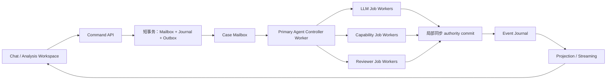

# WAJE BI Agent vNext Gate 0–2 durable async 回审与修订

## 1. 结论

用户提出的“整体异步、权威提交局部同步”应成为 WAJE runtime 顶层约束。原 Gate 1/2 已有
journal、outbox、CAS、checkpoint、case lease 和 effect attempt，具备部分耐久基础；Primary
Agent provider 仍在 controller 调用栈内同步执行，controller 只能持有一个 pending effect，
用户 correction 也只能在 `WAITING_FOR_USER` 分支进入。该形态无法安全支撑跨进程长任务、
运行中纠正和多个 evidence obligation。

本轮完成 Gate 0–2 amendment：

- command ingress 以短事务写入 durable case mailbox、journal 和 controller-wake outbox；
- 每条 command、action、job 和显式 controller event 具备
  operation/idempotency/causation/correlation、authority revision 与 payload hash；
- storage authority mutation 仍允许缺省派生 event operation；G3.2 必须改为显式接收 causal
  operation，并删除 production path 的静默缺省派生；
- Primary Agent provider 调用改为 durable outbox job，controller 状态显式包含
  `WAITING_FOR_LLM`；
- controller state 绑定 mailbox cursor、authority epoch 和多个 pending job IDs；
- effect/LLM 结果提交前同时验证 accepted head 与 authority epoch；
- correction 立即推进 epoch，旧 job 进入 `JOB_SUPERSEDED`，不能形成新 authority；
- LLM/effect worker 使用有 fencing token、heartbeat API 和 expiry state 的 job delivery
  lease；周期续租与过期接管后的旧 token 拒绝留给 G3.2；
- provider/effect 运行在数据库事务外，最终 authority admission 保持短事务；
- PostgreSQL schema 与 in-memory conformance adapter 同步实现 mailbox、operation identity、
  outbox fence 和 job lease；
- 技术 retry 复用原 outbox/effect identity，业务 correction 推进 authority epoch。

本 Gate 无需用户决策。架构方向、当前无兼容义务和 correction 语义已由用户明确；其余事实可
从代码和合同查明。

## 2. 原实现缺口证据

| 缺口 | 原位置 | 风险 |
|---|---|---|
| `advance()` 直接调用 `provider.propose()` | `vnext/services/analysis_core/src/waje_vnext/controller/runtime.py` | HTTP 生命周期、controller 进程和 LLM 延迟耦合；进程崩溃时缺少 durable job identity |
| 单个 `pending_outbox_message_id` | `domain/controller.py` | 无法表达多个独立 obligation 并发 |
| correction 只经 `submit_user_decision()` | `controller/runtime.py` | effect/review 运行中无法立即产生新消息权威 |
| stale 检查只比较 checkpoint | `_require_same_checkpoint()` | correction 不移动 checkpoint 时，旧结果可能仍被接纳 |
| outbox 只有 effect payload | `domain/runtime_state.py`、migration 001 | 缺少 job kind、operation lineage、authority fence |
| 无 worker job lease/heartbeat | migration 002 与 storage ports | 重复 delivery 会浪费 provider/capability 资源，无法可控接管超时 worker |
| event 缺少统一 operation identity | `domain/events.py` | causation/correlation 和 payload tamper proof 不完整 |

## 3. Gate 0 调整

### 3.1 部署边界



逻辑部署单元为 command API、case controller worker、LLM/capability/reviewer job workers、
journal/projection worker 和 streaming transport。当前 Gate 0–2 生产包继续位于独立
`vnext/` 根；Gate 6 才交付完整 SSE/WebSocket 与 Workbench。跨单元通信只消费
`vnext/contracts/` 和 durable PostgreSQL records。

### 3.2 隔离影响

- 新增边界全部位于 `vnext/`，未引入旧 runtime、旧 queue 或旧 API。
- PostgreSQL 仍使用独立 `waje_vnext` schema 和 migration ledger。
- 不引入 Redis/in-memory queue 作为权威或恢复依赖。
- Python baseline 保持 3.12.13 virtualenv，宿主解释器不改变项目要求。

Gate 0 exit 继续成立；服务边界说明已从“单体 analysis core 请求循环”修订为可拆分的 durable
workers。

## 4. Gate 1 调整

### 4.1 命令与 operation identity

`OperationIdentity` 固定：

```text
operation_id
idempotency_key
causation_id
correlation_id
authority_revision
payload_sha256
```

它进入 mailbox message、typed action、event journal 和 outbox job。JSON Schema 与生成的
TypeScript binding 同步更新。payload hash 在 domain constructor 验证，数据库同时保存可查
字段和完整 immutable payload。

### 4.2 Durable mailbox

每个 `InvestigationCase` 有：

- `case_mailbox_heads.last_sequence`；
- `case_mailbox_heads.authority_epoch`；
- append-only `case_mailbox_messages`；
- case 内 message sequence 与 idempotency 唯一约束。

正常用户消息、correction、challenge 和 scope revision 都推进 authority epoch。mailbox
只保存用户 command；controller wake 属于 durable outbox job。controller checkpoint 记录
已纳入有序 `ContextPacket.user_messages[]` 的 mailbox cursor 与 authority epoch；后续
MessageImpactBinding 逐条决定合并、覆盖、纠正或澄清关系。

### 4.3 原子提交边界

同一个短数据库事务必须包含：

1. mailbox append 或 accepted-head CAS；
2. journal append；
3. 由该事实产生的 outbox enqueue；
4. 需要时写 checkpoint / projection trigger。

in-memory adapter 通过完整 snapshot rollback 验证原子性；PostgreSQL adapter 使用外层
transaction 和内部 savepoint，任一写入失败时整体回滚。

### 4.4 Outbox fence

每个 outbox job 固定：

- `job_kind`；
- `operation`；
- `expected_head_version`；
- `expected_authority_epoch`；
- immutable payload / hash；
- source journal cursor。

effect job 必须绑定已接纳 typed action，job kind 与 action kind 必须匹配。controller wake、
Primary Agent、Reviewer 和 projection 属于独立 system job family。

Gate 1 exit 继续成立，并新增 mailbox/operation/outbox-fence contract tests。

## 5. Gate 2 调整

### 5.1 Durable async controller

`advance()` 只构造 `PrimaryAgentRequest`、写 `LLM_JOB_ENQUEUED`、enqueue outbox 并 checkpoint
为 `WAITING_FOR_LLM`。provider worker 之后执行 `deliver_pending_llm()`。LLM 调用完成后，
controller 在短事务中重新验证：

- checkpoint；
- accepted head；
- mailbox authority epoch；
- job operation identity。

通过后才记录 `LLM_JOB_COMPLETED`、typed action、admission 和 authority mutation。

controller interruption states 现包含：

```text
READY_FOR_AGENT
WAITING_FOR_LLM
WAITING_FOR_EFFECT
WAITING_FOR_REVIEW
WAITING_FOR_USER
COMPLETED
STOPPED
```

`pending_job_ids[]` 可以表达多个异步 job。Gate 3 将实现 obligation-aware fan-out/fan-in 和
Reviewer scheduler；Gate 2 已提供可持久化状态、outbox 和 stale-result admission substrate。

### 5.2 Correction fence

任何运行阶段都可调用统一 ingress。correction 的短事务提交后，新 authority epoch 立即可见：

- 尚未开始的旧 job 在 worker 领取前被判 stale；
- 运行中的 job 可以保存 attempt/result receipt；
- 最终 authority admission 检测 epoch mismatch，写 `JOB_SUPERSEDED`；
- superseded result 不进入新 Evidence、Answer 或 succeeded Workflow；
- controller 消费新 mailbox cursor 后以新用户消息重新进入 `READY_FOR_AGENT`。

该机制不解释 correction 的开放业务含义。Gate 3 的 typed MessageImpactBinding 决定
`explain_existing | revise_question | ask_clarification`。

### 5.3 Worker recovery

outbox delivery lease 保存 owner、fencing token、acquired/heartbeat/expiry。短任务可由
当前 handler acquire/release；worker crash 后，storage contract 允许 lease 到期并由另一
进程接管。当前 handler 尚无长任务 periodic heartbeat supervisor，旧 worker 在 lease
过期后的 token 也尚未进入 authority-commit 校验，所以这两项明确保留为 G3.2 blocker。
at-least-once delivery 仍是基础假设；当前幂等记录、CAS、唯一约束与 head/epoch fence
保证已覆盖路径的 effectively-once authority mutation。

provider timeout/retry 仍集中在 provider layer；effect retry 继续复用同一 outbox identity 和
effect attempt chain。

## 6. 测试证据

新增或重写的 Gate 0–2 tests 覆盖：

- Primary Agent 调用与 command HTTP 生命周期解耦；
- correction 在 LLM job 运行前 fence 旧结果；
- correction 在 effect 运行中到达，旧 result receipt 保留且 admission 被拒；
- duplicate ingress 只产生一个 mailbox authority；
- 并发 fresh-case ingress 只创建一个 case head，mailbox burst 保留初始问题及全部有序
  correction lineage；
- mailbox + journal + outbox 任一写失败时整体 rollback；
- 并发 worker 只能提交一个 Primary Agent proposal；
- authority commit 在持有 mailbox head lock 时完成最终 head/epoch fence，覆盖
  correction-vs-result 的 PostgreSQL 线性化竞态；
- job/controller lease 使用数据库时钟仲裁；fencing token 单调递增，expired heartbeat、
  stale release 与同 owner 重入均被拒绝；
- provider retry 保持在 provider adapter；
- crash-before-checkpoint 后从 durable LLM job 继续；
- action/event/outbox/ControllerState 的 JSON Schema 与 generated TypeScript 一致；
- PostgreSQL migration 声明 mailbox、authority epoch、outbox fence 和 heartbeat lease。

本轮验证结果：

- `npm run test:bootstrap`：70 tests discovered，63 passed，7 个外部 PostgreSQL 条件测试
  skipped；
- `npm run test:postgres`：临时 PostgreSQL 17 上 2 tests passed；
- `npm run test:postgres:gate2`：临时 PostgreSQL 17 上 5 tests passed；
- `npm run check:contracts`、`npm run check:evals:gate3` 与 clean-copy
  `npm run check` 全部通过。

临时 PostgreSQL acceptance 实际执行 migration、append-only trigger、CAS 并发、async
controller checkpoint/retry/resume 与 lease fencing。容器使用 tmpfs，验收后删除。

## 7. 对 Gate 3 的强制影响

Gate 3 只能在上述 substrate 上实现：

- MessageImpactBinding 与 Frame candidate review 都是 durable async saga；
- independent obligations 可并行执行，authority admission 按 case 串行；
- review/effect/result 可乱序完成，admission 必须重算 accepted heads 与 epoch；
- correction-vs-effect、correction-vs-review、parallel obligations、out-of-order completion、
  duplicate delivery、crash/resume 和 stale-result rejection 属于 hard conformance suite；
- Workflow 读取 accepted WorkPlan + journal/projection，不能把 queue、worker 或模型节点当
  成业务流程；
- SSE/WebSocket 只传 cursor-based projection，断连不影响 run。

## 8. 未交付边界

- Gate 3 尚未实现 QuestionRevision、MessageImpactBinding、Frame candidate review、
  obligation fan-out/fan-in 或 Reviewer worker。
- Gate 6 尚未实现完整 projection store、SSE/WebSocket 和双栏 Workbench。
- `policy_ready=false` 仍阻止 Gate 3 生产实现开始；真实问题措辞已补齐，双审、registry、
  calibration、held-out 与剩余 adversarial findings 仍开放。
