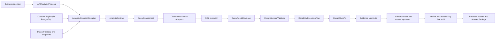

# ClickHouse Query Completeness and Analysis Contracts Design

**Status:** Approved in design review on 2026-07-10

**Scope:** Full multi-source analytical loop for paid orders, market dashboard, gameplay, internal operation events, and external events

**Runtime boundary:** ClickHouse is the analytical store; PostgreSQL is the versioned contract, snapshot, run, evidence, and asset store; LLMs propose and interpret analysis inside WAJE-owned hard boundaries.

## 1. Goal

Build a production query and analysis-contract layer that can prove all of the following independently:

1. The intended ClickHouse query ran.
2. The returned rows cover the requested dates, baselines, metrics, dimensions, grain, and source snapshots.
3. A named analytical capability has the inputs required to execute.
4. Each published business claim stays within the strength supported by its evidence.

The design must remove false `insufficient_evidence` caused by query-window drift, row-shape mismatch, hidden truncation, arbitrary capability fallbacks, and missing source bindings. It must also distinguish data absence from contract absence, permission limits, stale snapshots, unsupported grain, and incomplete query results.

## 2. Current Findings

The real eight-question revenue evaluation reached ClickHouse and generated result references, but most answers degraded to evidence insufficiency. The dominant failure is upstream of final answer generation.

### 2.1 Window drift

The accepted paid-order snapshot ends on `2026-07-04`, while the runtime evaluates `now('Africa/Lagos') - 1`. Runs on 2026-07-10 therefore query `2026-07-09` as the target. ClickHouse successfully returns historical rows through 2026-07-04, but no target row exists.

The current system then reports `no_comparable_periods`, even though the real condition is `window_data_unavailable` for the requested target date.

### 2.2 Three independent window interpretations

- The compiler keeps symbolic values such as `yesterday` and `recent_30d`.
- The ClickHouse planner resolves dates with database `now()`.
- Capability binding guesses a usable baseline from string candidates such as `baseline`, `previous_day`, `rolling_7_day_baseline`, and `history`.

These interpretations can disagree within one run.

### 2.3 Overlapping baselines cannot be represented safely

One row currently receives one `group` through `multiIf`. A date can belong to both `same_weekday_last_week` and `rolling_7_day_baseline`; `multiIf` assigns only the first matching group. This silently removes one valid window membership.

### 2.4 Query success is overloaded

`RevenueRowsResult.ok=True` currently means SQL execution and basic row mapping succeeded. It does not prove that:

- the target or baselines are present;
- all required fields are non-null;
- the result matches the required grain;
- a `LIMIT 5000` result is complete;
- dimensional totals reconcile to the overall total;
- a multi-source join avoided duplication;
- a capability can consume the rows.

### 2.5 Capability input fallback hides mismatches

`_capability_rows_for` selects the first available result for a preferred query intent and falls back to generic rows. A capability can therefore run against a row set that lacks its required windows, dimensions, or measures. Empty capability output is later misclassified as weak evidence.

### 2.6 Multi-source contracts are ahead of physical runtime binding

- Paid-order raw and clean tables are loaded in ClickHouse and have an accepted current-snapshot source contract.
- Market-dashboard CSVs, gameplay CSVs, and the external-event workbook have profiled source contracts but no current ClickHouse runtime loaders in this repository.
- Internal operation events have contract requirements but no maintained source dataset.

Contract files alone cannot count as runtime data availability.

## 3. Design Principles

- LLMs propose business interpretation, analysis routes, candidate dimensions, repair choices, and final narrative.
- Deterministic code owns contract binding, dates, formulas, permissions, SQL safety, result completeness, and claim ceilings.
- The compiler validates an LLM proposal; it does not replace business reasoning with keyword routing or a local normalizer.
- Every fix must describe a reusable failure class. No branch may exist solely for one eval sentence or one observed LLM response.
- Query execution, result completeness, capability readiness, and claim publishability remain separate states.
- No high-value LLM node receives a local narrative fallback.
- Final quality audit records LLM-judged risks and warnings without blocking display. Permission, SQL safety, contract legality, and evidence-verifier boundaries remain hard.
- Raw identifiers remain inside ClickHouse. Capability inputs and evidence are aggregate-only.
- Hidden truncation is forbidden. If a safety limit is reached, the result is explicitly partial and the planner splits or narrows the query through a contract-preserving repair.

## 4. Target Architecture



The architecture introduces a narrow typed intermediate representation. It is not a general semantic-query language. It covers the six objects required by the current revenue analysis domain:

1. dataset snapshots;
2. metric expressions;
3. resolved analysis windows;
4. dimensions and contract-backed joins;
5. expected result shapes and completeness assertions;
6. evidence and claim boundaries.

## 5. Contract Model

### 5.1 AnalysisProposal

`AnalysisProposal` is LLM-authored and advisory. It may include:

- business question families and sub-intents;
- target metrics and candidate component metrics;
- proposed target and comparison semantics;
- candidate dimensions and factor paths;
- proposed capabilities;
- clarification candidates;
- expected business decisions and follow-up paths.

The proposal never asserts that data exists, a contract is valid, a query is safe, or evidence is verified.

### 5.2 AnalysisContract

`AnalysisContract` is compiler-authored and versioned. Its required fields are:

```json
{
  "analysis_contract_id": "analysis:<run_id>:<version>",
  "contract_version": "1",
  "question_families": ["paid_amount_change_explanation"],
  "target_metric_refs": ["metric:paid_amount@<version>"],
  "claim_intents": ["change_explanation", "driver_ranking"],
  "scope": {"type": "full_sample"},
  "business_timezone": "Africa/Lagos",
  "as_of": "<ISO-8601 timestamp>",
  "resolved_windows": [],
  "metric_bindings": [],
  "dimension_bindings": [],
  "dataset_requirements": [],
  "capability_requirements": [],
  "permission_scope": "analyst",
  "contract_gaps": [],
  "clarification_outcome_ref": "<ref or empty>"
}
```

Each gap carries a typed cause:

- `data_absent`
- `contract_absent`
- `contract_partial`
- `permission_blocked`
- `unsupported_grain`
- `snapshot_stale`
- `window_data_unavailable`
- `join_contract_absent`
- `source_unbound`

Every gap includes affected capabilities, affected claim types, owner, repair options, and whether user clarification can change the execution path.

### 5.3 ResolvedWindow

The compiler resolves all symbolic time semantics once:

```json
{
  "window_id": "target_day",
  "role": "target",
  "label": "2026-06-02",
  "start_inclusive": "2026-06-02",
  "end_exclusive": "2026-06-03",
  "timezone": "Africa/Lagos",
  "aggregation": "daily_total",
  "required_complete_days": 1,
  "source_watermark_requirement": "2026-06-02",
  "membership_policy": "allow_overlap"
}
```

Rules:

- Runtime SQL receives concrete window boundaries and cannot call `now()` to define business semantics.
- A source watermark must cover every required complete day.
- A business observation may belong to multiple windows.
- Rolling baselines define both membership and aggregation. For the eight-question revenue eval, the rolling baseline is the arithmetic mean of seven complete daily metric values.
- The same-weekday baseline remains an independent window even when its date also belongs to the rolling baseline.
- Literal “昨天” keeps calendar meaning. If unavailable, the system records `window_data_unavailable` and lets the LLM offer “wait for refresh” or “use the latest complete business day.” It never shifts the date silently.

### 5.4 MetricBinding

Metric expressions move from the Python `MEASURE_SQL` dictionary into versioned metric contracts. A binding includes:

- metric id and contract version;
- source dataset and source fields;
- aggregation and filters;
- numerator and denominator when applicable;
- business grain and allowed rollups;
- null, zero-denominator, currency, status, and dedup policy;
- reconciliation source when multiple datasets expose a similar metric;
- supported evidence and claim types.

Important revenue bindings:

- `paid_amount`: accepted final successful, deduplicated payment amount from the clean paid-order dataset.
- `paid_users`: distinct successful paying users at the requested grain.
- `paid_orders`: distinct accepted paid orders; row count is allowed only after the source contract proves one row per accepted order.
- `first_paid_users`: distinct users satisfying the accepted first-payment policy, not count of first-payment rows.
- `paid_frequency`: paid orders divided by paid users.
- `avg_order_amount`: paid amount divided by paid orders.
- `payment_success_rate`: accepted successful final payment orders divided by contract-eligible initiated payment orders from the raw payment dataset.
- `high_value_user_contribution`: threshold contract, reference horizon, aggregation grain, and privacy-safe output are versioned together.

### 5.5 DimensionBinding and JoinBinding

A dimension binding declares source field, business meaning, enum policy, null bucket, allowed grains, permission boundary, and cardinality profile.

A join binding declares:

- left and right dataset refs;
- join keys and temporal alignment;
- expected relationship cardinality;
- allowed metrics after the join;
- required coverage and reconciliation checks;
- claim wording limit.

Literal channel matching across paid orders, market dashboard, and gameplay is allowed only where the reviewed contracts permit it. No alias inference or package-family merge is performed locally.

Gameplay activity can support contextual association with revenue. It cannot support gameplay paid-amount contribution until an order-to-gameplay linkage contract exists.

## 6. Compiler Responsibilities

The compiler runs these stages:

1. **Proposal validation:** validate schema and preserve the LLM’s business intent and alternative paths.
2. **Dataset discovery:** resolve required sources through the PostgreSQL dataset catalog.
3. **Contract binding:** bind metrics, dimensions, joins, capabilities, permissions, and claim limits.
4. **Window resolution:** resolve all dates against business timezone, `as_of`, snapshot watermarks, and completeness policy.
5. **Gap diagnosis:** distinguish source absence, field presence, contract presence, permission, grain, freshness, and join support.
6. **Query compilation:** emit one or more `QueryContract` objects and explicit capability input slots.
7. **Repair decision:** return executable work, LLM-assisted repair options, or clarification choices.

The compiler does not generate insight text, rank business causes, or interpret weak statistical evidence.

## 7. QueryContract and SQL Generation

### 7.1 QueryContract

Each ClickHouse query is governed by:

```json
{
  "query_contract_id": "query:<run_id>:<intent>:<version>",
  "query_intent": "dimension_contribution_scan",
  "dataset_snapshot_refs": ["snapshot:paid_order:<version>"],
  "metric_bindings": ["metric:paid_amount@<version>"],
  "dimension_bindings": ["dimension:channel@<version>"],
  "window_refs": ["target_day", "previous_day"],
  "filters": [],
  "result_shape": {},
  "completeness_assertions": [],
  "permission_scope": "analyst",
  "workload_class": "interactive_aggregate",
  "contract_signature": "<stable hash>"
}
```

The query contract is the source for SQL generation. Query planners cannot add measures, dimensions, joins, or windows that are absent from the contract.

### 7.2 Source adapters

The runtime provides one adapter per logical dataset family:

- paid-order success adapter;
- raw payment-attempt adapter;
- market-dashboard adapter;
- gameplay adapter;
- operation-event adapter;
- external-event adapter.

Adapters own physical column names and ClickHouse-specific SQL. Business semantics remain in contracts.

### 7.3 Window membership

SQL represents overlapping windows with a window relation or `UNION ALL`, producing:

- `window_id`
- `window_role`
- `observation_key`
- metric values
- dimension values
- `source_snapshot_ref`

The overloaded `group` field remains only in a temporary compatibility adapter for existing capabilities. New capability contracts use explicit window fields.

### 7.4 Dimensional query strategy

Dimension and joint attribution use two stages:

1. Independently scan each contracted dimension. Validate target/baseline pairing, cardinality, null coverage, sample size, and reconciliation to the total.
2. Rank candidate dimensions from verified evidence, then query only contract-valid combinations. Joint queries retain all requested dimensions and expose combination coverage.

The runtime does not combine four high-cardinality dimensions into one query and silently accept the first 5,000 rows.

### 7.5 Workload safety

Query budgets are configured per workload class. Reaching a row, memory, or execution bound yields `truncated` or `failed`, never `complete`. The planner may split by window, dimension, or candidate set while preserving the original analysis contract. It may not drop requested analytical scope without an explicit degraded contract.

## 8. QueryResultEnvelope and Completeness

### 8.1 Result envelope

Every query returns:

```json
{
  "query_contract_ref": "query:<id>",
  "query_id": "<provider query id>",
  "query_hash": "<sql hash>",
  "result_ref": "result:<id>",
  "execution_status": "succeeded",
  "rows_ref": "artifact-or-internal-ref",
  "row_count": 0,
  "observed_schema": {},
  "observed_windows": [],
  "observed_grain": [],
  "source_snapshot_refs": [],
  "provider_stats": {},
  "completeness_report_ref": "completeness:<id>"
}
```

### 8.2 Independent statuses

`execution_status`:

- `planned`
- `running`
- `succeeded`
- `failed`
- `blocked`

`completeness_status`:

- `complete`
- `partial`
- `empty`
- `truncated`
- `stale`
- `invalid`

`analysis_readiness`:

- `ready`
- `degraded`
- `blocked`

SQL success cannot promote completeness or readiness by itself.

### 8.3 Completeness assertions

The validator checks:

- expected target and every baseline window are present;
- source watermark covers all required complete days;
- required fields and types are present;
- required metrics are non-null and denominators are valid;
- result grain and uniqueness match the contract;
- observed row count is not capped by a hidden limit;
- dimension and joint combinations have paired target/baseline observations;
- dimensional totals reconcile to overall totals within the metric contract tolerance;
- rolling windows contain the required number of complete days;
- source joins meet cardinality and coverage requirements;
- source snapshots, permission scope, query hash, and result ref are attached;
- query output contains no disallowed identifiers.

Completeness reasons are typed and machine-readable. The LLM receives business-readable summaries generated from the typed report, not ad hoc local diagnosis prose.

## 9. Capability Binding

The compiler emits one `CapabilityExecutionPlan` per accepted capability:

```json
{
  "capability_id": "joint_attribution",
  "capability_contract_ref": "capability:joint_attribution@<version>",
  "required_input_slots": [],
  "optional_input_slots": [],
  "merge_strategy": "contract_defined",
  "minimum_readiness": {},
  "degradation_policy": {},
  "supported_evidence_types": [],
  "maximum_claim_strength": "medium"
}
```

Each input slot references exact query contracts and completeness requirements. The runtime removes these behaviors:

- first available intent wins;
- generic rows fallback;
- dimension inference from arbitrary non-measure fields;
- result refs inherited from an unrelated query.

Capabilities execute when required slots are ready. Optional slot loss can yield a degraded execution if the capability contract allows it. Missing required slots yield a typed blocked result and trigger repair planning or honest evidence insufficiency.

## 10. Repair and Clarification

Repair causes are classified as:

- transient ClickHouse execution failure;
- SQL or result-shape mismatch;
- schema binding drift;
- window coverage failure;
- join coverage or cardinality failure;
- contract gap;
- permission block;
- insufficient sample or business signal.

Rules:

- Transient database failures retry in the ClickHouse adapter under one centralized policy.
- SQL, schema, window, and shape failures re-enter compiler repair with the failure report.
- Contract, source, permission, and sample gaps do not repeat an identical query.
- A repair attempt must change the query contract signature, analysis contract signature, or source snapshot ref.
- The runtime records attempted signatures to prevent loops.
- When a repair changes the business date, baseline, grain, permission exposure, claim strength, or material execution cost, the LLM produces a business clarification with 2-3 options and a recommendation.
- `waiting_for_clarification` remains a valid intermediate state, and resume continues the original topic.

## 11. Evidence, Claims, and Analysis Assets

### 11.1 Evidence manifest

Every capability result carries:

- analysis contract ref;
- capability contract ref;
- query contract refs;
- query result refs;
- completeness report refs;
- source snapshot refs;
- metric, dimension, window, and parameter signatures;
- actual sample, grain, coverage, and reconciliation summaries;
- evidence type, strength, limitations, and supported claim types.

These references flow into `context_manifest` and the Answer Package.

### 11.2 Claim verification

A claim is supportable only when it references evidence whose capability contract allows that claim type and whose source completeness meets the claim threshold. The verifier checks references, permission, evidence strength, formula boundaries, and causal wording.

Presentation quality, style, unsupported-wording heuristics, and insight tone are handled by the LLM final audit as nonblocking risk markers. They do not discard an otherwise valid answer.

### 11.3 Analysis assets

Asset reuse signatures include:

- metric, dimension, grain, and filters;
- concrete resolved windows;
- dataset snapshot refs and watermarks;
- analysis, query, and capability contract versions;
- permission scope;
- completeness status and coverage digest.

Only complete compatible assets can support claims. A partially matching asset may supply covered windows while the compiler issues delta queries for missing windows. Context-only assets remain available to the LLM but cannot be promoted to verified evidence.

## 12. Storage Boundaries

### 12.1 ClickHouse

ClickHouse stores:

- raw payment orders;
- accepted clean payment facts;
- market-dashboard daily and channel-day facts;
- gameplay day, gameplay, service-scope, and channel facts;
- normalized external and operation events;
- query-oriented aggregate tables or materialized views where profiling justifies them.

Physical tables may be snapshot-specific. Runtime code resolves them through dataset refs and never relies on a hard-coded default snapshot table.

### 12.2 PostgreSQL

PostgreSQL stores versioned records for:

- analysis contracts;
- metric, dimension, join, capability, and source contract mirrors;
- dataset snapshots and watermarks;
- query contracts and query runs;
- completeness reports;
- evidence manifests and claim-evidence links;
- analysis assets and reuse decisions;
- repair attempts and clarification outcomes.

No standalone PostgreSQL product page is introduced. These records feed audit APIs and future operations functionality.

## 13. Multi-Source Delivery

### 13.1 Paid orders

Use both existing ClickHouse sources:

- clean accepted-success table for paid amount and successful-order metrics;
- raw order table for payment status, eligible attempts, dedup validation, latency, and success-rate denominators.

The loader metadata table becomes a registered dataset snapshot with start date, end date, export timestamp, row counts, schema fingerprint, and accepted source contract version.

### 13.2 Market dashboard

Create idempotent loaders for overall daily CSV and filename-channel CSVs. Preserve the existing contract boundary:

- daily and channel-day formula components are allowed;
- dashboard metrics reconcile against paid-order metrics where semantically comparable;
- aggregate marketing cost is context, not campaign budget, exposure, ROI, ROAS, CPA, or net impact;
- channel joins use reviewed literal matching only.

### 13.3 Gameplay

Create idempotent overall and channel loaders. Preserve source-provided activity, betting, GGR, and service-scope metrics. The compiler can query gameplay context and same-window associations. Paid-amount contribution stays blocked until an order-to-gameplay linkage source and contract exist.

### 13.4 External events

Implement a WAJE-owned workbook loader from the reviewed source contract. Do not import old WAJE runtime code. Normalize event date/window, type, scope, source authority, evidence level, and wording limit. Current evidence supports context and candidate mechanisms only.

### 13.5 Internal operation events

Define and implement the normalized ingestion contract for activities, versions, creative changes, spend/budget changes, payment incidents, and operational incidents. Current source data is absent, so implementation delivers:

- accepted input schema and validation;
- idempotent import interface;
- ClickHouse event table and adapter;
- PostgreSQL snapshot registration;
- explicit `source_unbound` diagnostics with the data/operations owner.

No live eval may claim internal-event impact until a maintained source snapshot is registered.

## 14. Testing Strategy

### 14.1 Logic tests

Logic tests use relative clocks and generated fixtures. They cover:

- yesterday, custom ranges, rolling windows, same-weekday windows, and overlapping membership;
- Africa/Lagos boundaries and `as_of` behavior;
- stale and partially covered snapshots;
- source present with contract absent, contract present with source absent, and permission-limited fields;
- metric formulas, numerator/denominator boundaries, nulls, and zero denominators;
- schema drift, invalid grain, duplicate keys, join amplification, and reconciliation mismatch;
- hidden truncation and split-query repair;
- exact capability input binding;
- partial asset reuse and delta query generation;
- clarification and resume when a repair changes business semantics.

### 14.2 ClickHouse integration tests

Ephemeral integration fixtures include:

- complete target and baseline rows;
- missing target with historical rows present;
- seven-day rolling baseline with one missing day;
- one date belonging to two baseline windows;
- high-cardinality dimensions beyond a configured result bound;
- one-to-many joins that would inflate revenue;
- raw status rows with duplicate success records;
- source snapshots with different watermarks.

### 14.3 PostgreSQL integration tests

Tests verify versioned contract lookup, dataset snapshot binding, run persistence, completeness references, evidence relationships, asset signatures, repair history, and clarification resume state.

### 14.4 Conversation runtime tests

All end-to-end logic tests enter through `ConversationAgentCore` or Gateway API. A node runner can diagnose one node but cannot count as end-to-end acceptance.

Tests cover:

- full answer path;
- waiting for clarification and resume on the original topic;
- query repair with failure reason;
- capability degradation without unrelated row fallback;
- multi-turn reuse with compatible and incompatible snapshots;
- visible business answer despite nonblocking final-audit warnings.

## 15. Fixed Real Quality Evaluation

Production logic remains relative to the real run clock. The real quality eval uses a fixed clock and fixed dates so that calendar drift cannot invalidate it.

The latest common current watermark across paid orders, market dashboard, gameplay, and external events is `2026-06-02`. The fixed evaluation clock and windows are:

- `as_of`: `2026-06-03T12:00:00+01:00`
- target day: `2026-06-02`
- previous day: `2026-06-01`
- rolling seven complete days: `2026-05-26` through `2026-06-01`
- same weekday last week: `2026-05-26`
- recurring-pattern history: `2026-01-01` through `2026-06-02`
- anomaly and high-value reference history: `2026-05-03` through `2026-06-01`

Before freezing the fixture, a one-time coverage probe must verify that all registered source snapshots contain their declared complete dates. The selected dates are then committed in the eval case and do not move with system time.

The eight business questions are evaluated with real LLM, ClickHouse, and PostgreSQL. Each turn records:

- compiled analysis and query contracts;
- execution and completeness states;
- capability readiness;
- context manifest and reuse decisions;
- evidence, result, artifact, and memory refs;
- final LLM audit risks;
- human-readable business answer.

### 15.1 Per-question analytical acceptance

1. **Revenue change drivers:** target and baseline paid users, first-paid users, frequency, ticket size, and contract-supported payment success rate are available or carry exact source/contract gaps.
2. **Recurring patterns:** weekly, month-phase, and hourly routes are independently planned; driver dimensions use verified single-dimension scans before joint analysis.
3. **Events and operations:** available external and aggregate spend context is assessed within its wording limit; absent internal events identify the missing maintained source and owner.
4. **Revenue health:** normal growth, user mix, high-value concentration, event dependence, and channel concentration use their own evidence contracts.
5. **Top factors:** dimensions reconcile to total revenue, candidate joint combinations are complete, and Top 3 claims cite evidence.
6. **Anomaly review:** anomaly dates and contribution paths trace to fixed windows and query results.
7. **Multi-baseline comparison:** all three baselines coexist, including overlapping membership, and each comparison uses the correct aggregation.
8. **Evidence quality:** freshness, attribution coverage, payment status, duplicates, and abnormal-user influence are reported separately.

### 15.2 Eval success criteria

- Every executed query has a query contract, snapshot ref, result ref, and completeness report.
- No query with a missing required target, hidden truncation, invalid grain, or failed reconciliation is marked complete.
- No capability consumes an unbound or incomplete required input.
- Every supportable claim has context manifest, ReuseDecision, evidence/result/artifact/memory refs.
- All eight turns return a user-visible Chinese business answer.
- Evidence gaps remain honest and typed; no local narrative template converts them into apparent success.
- Final quality warnings remain observable and nonblocking.
- Human quality review scores insight, directness, actionability, and evidence discipline separately from runtime correctness.

## 16. Observability

Per run, publish internal metrics for:

- planned, executed, complete, partial, stale, truncated, and failed queries;
- missing target and missing baseline windows;
- schema and contract drift;
- dimension reconciliation and join amplification failures;
- capability ready, degraded, and blocked counts;
- repair attempts by cause and repeated-signature prevention;
- asset reuse and delta-query rate;
- verified claim count and evidence-gap count;
- ClickHouse rows read, bytes read, latency, and provider exceptions;
- LLM latency, retries, final-audit warnings, and answer completion.

The business trace exposes the analytical meaning of gaps and repairs. Raw SQL, hidden reasoning, provider metadata, and internal field names stay in restricted audit output.

## 17. Rollout

1. Introduce typed contracts and completeness validation while preserving the existing query path behind an adapter.
2. Migrate paid-order queries and capabilities to exact input slots.
3. Register existing paid-order snapshots and persist query/completeness/evidence records in PostgreSQL.
4. Load and bind market-dashboard, gameplay, and external-event sources.
5. Add the internal-operation event ingestion contract and explicit unbound-source handling.
6. Run shadow dual execution for the fixed eight-question eval and the existing multi-turn, clarification, permission, and historical-failure conversation suites.
7. Compare old and new paths on query completeness, capability readiness, claim support, latency, and cost.
8. Promote the contract path after two consecutive fixed-eval runs satisfy Section 15.2 with no unresolved hard-boundary finding; keep the prior path for one release cycle, then remove arbitrary row fallbacks and hard-coded snapshot bindings.

## 18. Implementation Workstreams

The implementation plan will use tests first and one reviewable commit per workstream:

1. typed analysis, window, query, result, and completeness contracts;
2. dataset catalog, source snapshot registration, and deterministic window resolution;
3. contract-backed metric/dimension registry and ClickHouse query adapters;
4. completeness validator, reconciliation, truncation detection, and query repair;
5. capability execution plans, exact input binding, evidence manifests, and asset reuse;
6. market-dashboard, gameplay, external-event, and internal-operation event ingestion boundaries;
7. PostgreSQL persistence, audit observability, and Gateway/ConversationAgentCore integration;
8. fixed real LLM + ClickHouse + PostgreSQL evaluation, shadow comparison, and delivery audit.

## 19. Out of Scope

- A general-purpose semantic SQL language.
- Automatic channel alias inference without owner-reviewed mappings.
- Raw user, order, IP, or device identifier output.
- Confirmed causal claims from temporal overlap alone.
- Gameplay paid-amount attribution without payment linkage.
- ROI, ROAS, CPA, or campaign net-impact claims from aggregate marketing cost.
- Fabricated internal operation events when no maintained source exists.
- A standalone PostgreSQL administration page.

## 20. Final Design Decisions

- Use a typed query-contract IR with source adapters and a completeness validator.
- Keep LLMs active for business planning, repair choices, evidence interpretation, and final narrative.
- Resolve business dates once in the compiler and pass concrete windows to ClickHouse.
- Permit overlapping window memberships.
- Separate execution, completeness, readiness, and claim states.
- Replace capability query-intent fallbacks with exact input slots.
- Store analytical facts in ClickHouse and versioned control/evidence state in PostgreSQL.
- Use fixed `2026-06-02` target data for full multi-source quality evaluation.
- Preserve honest degraded answers and nonblocking LLM final-audit risk markers.
- Keep `artifacts/` local and uncommitted.
